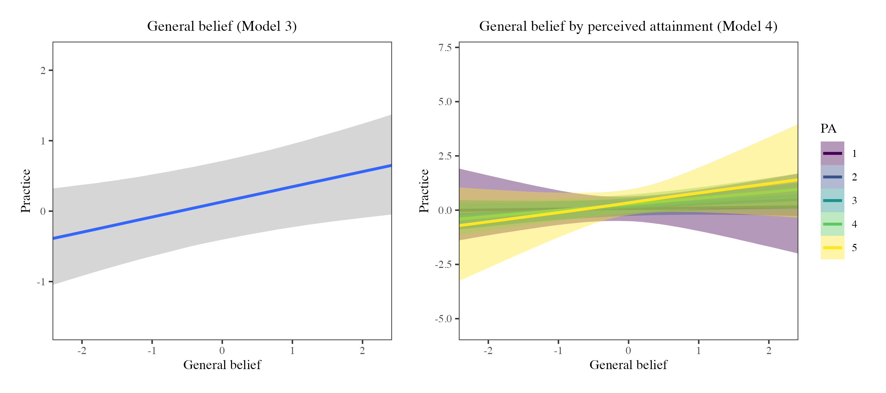
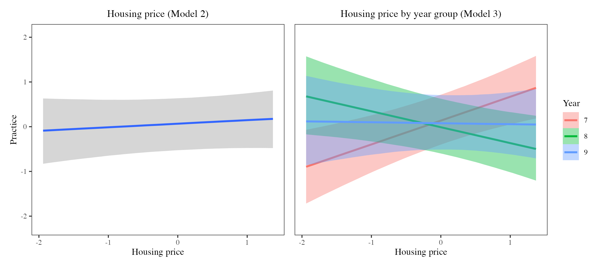

::: {.content-visible when-format="docx"}

**Abstract.** Educational reform often assumes that changing teachers' beliefs will change their classroom practice. Drawing on belief system theory and Bourdieu's theory of social reproduction, this study asks whether mathematics teachers' connectionist practice, the reform-oriented teaching that builds on students' own mathematical understandings, is more belief-driven or school-determined. Using questionnaire data from 155 mathematics teachers across 35 lower-secondary schools in Wenzhou, China, we fitted Bayesian multilevel models relating teachers' equity beliefs (a general equity orientation and three specific dimensions, about mathematics, learners, and pedagogy) and their school's socioeconomic position, indexed by neighbourhood housing price, to self-reported connectionist practice, propagating measurement and imputation uncertainty throughout. The results were asymmetric. Teachers with stronger general equity beliefs reported modestly more connectionist practice, whereas the specific belief dimensions showed no credible association. The school's socioeconomic position was associated with practice more strongly, and not in the same direction across grades: the association was positive in Year 7, negative in Year 8, and non-credible in Year 9. Where credible, the association with the school's socioeconomic position exceeded the association with general equity belief. Both teachers' beliefs and their school's socioeconomic position were associated with practice, with the school's position the stronger of the two and shifting with the grade taught. The findings caution against reforms that expect change from teachers' beliefs alone while leaving the structural conditions around them untouched. The analytical strategy, which carries measurement and imputation uncertainty through to the substantive model, is applicable to other settings where teacher-level and school-level influences must be weighed in samples of modest size.

:::

# Introduction

For global mathematics education reform agendas, there is a broad consensus among major international standards organisations that mathematics education should adopt an empowering model that connects abstract concepts with learners' lived experiences and real-world problem-solving [e.g., NCTM, -@nationalcouncilofteachersofmathematicsnctm2000princi; OECD, -@organisationforeconomicco-operationanddevelopmentoecd2023pisa]. Within public policy and educational research, such connectionist approaches are widely regarded as indicative of more desirable classroom practices, as they promote deeper conceptual understanding, support the development of positive mathematical identities among diverse learners, reduce mathematics anxiety, and prepare students for the complex problem-solving demands of contemporary society [@boaler1998open]. Classroom reform is treated here as a response to evolving societal demands that traditional, teacher-centred, transmissionist approaches struggle to address, and not simply as a matter of pedagogical preference.

Despite this consensus, a fundamental contradiction exists regarding the drivers of teachers' pedagogical choices and actions. Two competing explanatory frameworks dominate this discussion. The first centres on agency, positioning teachers' beliefs as the primary determinants of instructional decisions [@goldin2009belief; @goldin2002affect; @pajares1992teache; @thompson2006teache], in line with the intuitive notion that teachers practise what they believe. This perspective has inspired widespread professional development initiatives and interventions aimed at transforming classroom practice by cultivating teachers' related beliefs [e.g., @hunter2020shifti; @wright2021transfa].

That beliefs do not map straightforwardly onto practice is, in fact, well established: belief researchers have long held that beliefs are variable and context-dependent, and that their translation into action is mediated by the settings in which teachers work [@buehl2014relati; @skott2014promis; @francis2014indivi]. A second perspective takes those settings as its starting point. Drawing on Bourdieu's theory of social reproduction [@bourdieu1990reproda], it holds that the socioeconomic conditions of schooling can rival, or even outweigh, teachers' personal convictions in shaping practice. Capital, in this account, circulates in economic, cultural, and social forms that are mutually convertible [@bourdieu2018forms], and schooling is one of the mechanisms through which these advantages are transmitted and maintained, with teachers' instructional practice at times constrained by, and serving as a channel for, their reproduction. Schools serving different socioeconomic communities consistently demonstrate different institutional priorities and accountability pressures, and teachers often find themselves working within resource-limited contexts they have only partial latitude to shape [@nast2022bringi]. This may help explain why many well-intentioned mathematics education reform initiatives struggle during local implementation, as teachers' reform-oriented intentions meet specific institutional pressures [@leonard2014learni; @westaway2019explor]. Throughout this paper, we use structural factors to refer to such school-level conditions, the socioeconomic position, resources, and institutional circumstances of a school, that lie largely beyond an individual teacher's control.

[Which of the two carries more weight is a question for educational research generally. Reforms across subject areas commonly invest in professional development aimed at changing what teachers believe about teaching and learning. If the structural characteristics of schools bear on classroom practice as heavily as those beliefs, reform designed around teacher development alone will produce results that vary with the circumstances of individual schools. Separating teacher-level from school-level influences is therefore part of understanding how reforms are implemented, and why the same initiative takes hold in some schools and not others.]{.mark}

This tension is particularly pronounced in the Chinese educational context. For decades, China's Ministry of Education has consistently advocated for educational reforms aimed at moving mathematics instruction away from traditional practices characterised by rote memorisation, repetitive exercises, and competition-oriented instruction. The most recent mathematics curriculum standards introduced for the first time the "Three Capacities" as a core aim of mathematics classrooms: the capacity to observe, think about, and express the world through mathematics [MoE, -@ministryofeducationofthepeoplesrepublicofchina2022compul, pp. 5--6]. This policy emphasis signals a strengthened top-down reform expectation, that the exploration of the connections between mathematics and the real world should become a central classroom priority. However, despite substantial investment in reform initiatives and reported successes under controlled, experimental conditions such as demonstration lessons, teaching competitions, and designated experimental schools [@zhao2020episte], mathematics classroom practice in China continues to be dominated by teacher-centred and rote-oriented instruction, particularly in socioeconomically disadvantaged schools [@yin2012curric; @guo2023charac].

Building on this background, the present study investigates whether mathematics teachers' connectionist practices, broadly, practices that connect instruction to students' own understandings rather than transmit content one way [@pampaka2012associ], are, in the Chinese context, more belief-driven or school-determined. Employing Bayesian multilevel modelling (MLM), we examine how teachers' equity beliefs and school-level structural factors are jointly associated with self-reported connectionist practices, using questionnaire data from 155 teachers across 35 lower-secondary schools (Years 7--9) in Wenzhou.

Methodologically, the study addresses a limitation common in research that relates teacher beliefs to instructional practice. Belief and practice constructs are typically represented by estimated scale scores and entered into multilevel models as though they had been measured without error, and uncertainty arising from missing data is handled separately or left aside. Both simplifications understate what is not known. We use a Bayesian multilevel framework that carries [measurement uncertainty from the item response models, and missing-data uncertainty from imputation,]{.mark} through to the substantive analysis. Teacher-level beliefs and school-level socioeconomic conditions then sit within one probabilistic model, which makes the comparison of their estimated magnitudes, and of the uncertainty attached to each, more defensible. The specification also lets the association between school socioeconomic position and practice differ by grade, rather than assuming that structural context operates uniformly across instructional settings.

The methodological approach has application beyond the present case. Educational data are often hierarchically structured with few units at the higher level, [built on latent constructs,]{.mark} and frequently incomplete. Under these conditions, combining partial pooling with the propagation of measurement and imputation uncertainty yields stable probabilistic estimates of teacher- and school-level associations without recourse to large-sample asymptotic assumptions.

The paper is structured as follows. First, we review the research literature on connectionist mathematics pedagogies and their potential determinants. We then describe the research context and methodological approach, followed by the presentation of the analytical results and their interpretation. Finally, we discuss the implications of these findings for (mathematics) education reform efforts.

# Literature Review and Background of the study

## Connectionist pedagogic practice in mathematics classrooms

The effectiveness of mathematics teachers' pedagogic practices can be conceptualised in multiple ways. A wide range of instructional approaches, from project-based learning [@holmes2016explor; @kokotsaki2016projec] to dialogue-based pedagogy [@williams2020compat], culturally responsive pedagogy [@greer2009cultura; @nicol2024ethnom], and instructional scaffolding [@bakker2015scaffo], share a common intention to challenge traditional teacher-centred classrooms, in which one-way transmission of knowledge often predominates [@boaler1998open]. A substantial body of scholarship has argued that such transmissionist practices, whether explicit or implicit, limit many students from fully benefiting from mathematics [@williams2012use; @williams2016aliena].

In much of the literature, practices of this kind are signalled by looser labels such as student-centred or constructivist teaching [@simon1995recons; @swan2006learni], and in more recent work by ambitious teaching [@lampert2010using; @lampert2013keepin] and effective mathematics teaching practices [@leinwand2014princi; @askew2020identi]. Drawing on the connectionist orientation identified by @askew1997effecta, @pampaka2012associ framed these ideas more precisely under the concept of connectionism, defining "more desirable" practice as occurring when: i) instruction is connected to students' own mathematical understandings, developed through dialogue and a deliberate balance between teacher- and student-centred work, and ii) meaningful links are built within mathematical topics and between mathematics and other areas of knowledge. The transmissionist-connectionist continuum, and the scale measuring it, were developed by @pampaka2012associ and @pampaka2016mathem, building on a longer line of work characterising mathematics teaching (e.g., @swan2006designa); we adapt this scale here (detailed in the Methods). Their studies in UK secondary and post-secondary settings validated the measure and demonstrated systematic associations between teachers' self-reported practices and students' (declining) mathematics dispositions, suggesting that connectionist practices may help alleviate this decline. Consistent with how the construct was first operationalised, our instrument captures the self-reported frequency with which teachers perceive enacting these practices.

A growing body of empirical research has also shown that connectionist practices can enhance student mathematics learning outcomes [@arbaugh2006examin; @karakus2023unders], for instance promoting positive attitudes towards mathematics [@moyer2018attitu], fostering classroom engagement, and supporting students' adaptation [@lussenhop2024mathem; @nortvedt2020numera]. Moreover, such practices have been framed as an important pedagogical expression of commitments to equity and social justice in mathematics education [@felton-koestler2019childr; @wright2022progre]. Alongside this evidence on their benefits sits the question of what leads teachers to take up such practices in the first place, and in particular how far their use follows from individual belief systems and how far from the institutional and socioeconomic conditions of the school. That question bears directly on how reform-oriented pedagogical ideals are translated into classroom practice.

## Teachers' Beliefs about equity as decision-making mechanism

Teacher beliefs are widely regarded as one of the most important predictors of classroom practice [@goldin2009belief; @goldin2002affect]. Yet, a universally accepted definition of teacher beliefs remains elusive; in this study, we adopt a commonly used and deliberately loose definition proposed by @fives2012spring: beliefs are "subjective claims that the individual accepts or wants to be true." @goldin2009belief further underscore the ontological premise that every belief must be "attached to objects of belief" (p. 3). This perspective resonates with Thompson's [-@thompson2006teache] argument concerning belief mechanisms, which suggests that, when teachers' beliefs about specific objects are appropriately identified and measured, a coherent relationship between beliefs and instructional practices should be observable. Among the many objects of teacher belief, equity is especially pertinent to connectionist practice, since connectionist teaching is itself an equity-oriented practice: connecting instruction to the diverse understandings students bring is one way of enacting a commitment to their full mathematical participation [@felton-koestler2019childr; @wright2022progre]. This alignment motivates our focus on equity beliefs as the belief construct most likely to bear on connectionist practice.

Building on the conceptualisation of beliefs as object-specific, in the domain of equity in mathematics education, @felton-koestler2017mathem introduces a "What, Who, and How" (WWH) framework for two levels of belief attached to different objects. At the most general level, teachers hold a General Belief about equity reflecting deeply held convictions about students' entitlement to support and resources necessary to reach their full mathematical potential [@tomlinson2014differa]. This general belief is best understood as a superordinate equity orientation cutting across the three more specific dimensions below rather than a separate fourth dimension, an interpretation supported by the bifactor structure detailed in our companion measurement study [@zhang2026reusaba]. This general belief recognises that students, particularly those who are disadvantaged, require differentiated classroom support that affirms their identities and cultural backgrounds, and ensures that mathematics is experienced as personally and culturally meaningful [@choudry2024power]. Beyond the general level, beliefs can be further differentiated into three contextualised categories:

i) Belief about Mathematics (What): the extent to which teachers view mathematics as a human-constructed, context-rich discipline rather than a fixed, dehumanised entity of knowledge [@ernest1989impact; @ernest1989knowle].

ii) Belief about Learners (Who): the extent to which teachers perceive student diversity as an asset rather than an obstacle, endorse a growth-mindset view of mathematical ability [@dweck1988social], and position the mathematics classroom as a space to resist deficit-based assumptions and affirm the diverse strengths and funds of knowledge that students bring [@gonzalez1995funds; @moll1992funds].

iii) Belief about Pedagogy (How): the extent to which teachers are open to innovative, student-centred pedagogies and believe these can more effectively facilitate students' learning.

[In this study, equity beliefs comprise a general equity orientation together with three object-specific dimensions, consistent with belief system theory]{.mark} [@green1971activia; @leatham2006viewin][, which views beliefs as organised into systems that differ in centrality and in their bearing on action.]{.mark}

Whether such beliefs translate into connectionist practice, however, may itself depend on the classroom context a teacher faces. Research on teachers' growth-oriented beliefs suggests their effects are strongest under supportive conditions: @bostwick2020teache found that mathematics teachers' growth mindset enhanced engagement mainly where the class displayed a growth-oriented atmosphere, and @archambault2012teache reported that teachers' beliefs benefited higher-achieving students most. By analogy, teachers' equity beliefs may be enacted as connectionist practice more readily in classes they perceive as higher-attaining, and less so where lower perceived attainment invites more transmissionist, deficit-oriented responses. We therefore examine whether the association between general equity belief and connectionist practice is moderated by teachers' perceived class attainment.

## Questioning agency: socioeconomic status as a system-determined factor

Although a large body of research on beliefs suggests that teachers can, through their professional agency, translate their beliefs into classroom practice [@arbaugh2006examin; @cerda2017effect; @dearaujo2017connec; @pozas2020teache], social reproduction theory [@bourdieu1990reproda] provides a framework for attending to the constraints that broader structural forces impose on teachers' decision-making. From a Bourdieusian perspective, teachers may become unwitting agents of social reproduction enacting pedagogical practices within a persistent dialectical tension between agency and structure [@harker1990introd; @harker1984reprod].

Within schooling systems, students from different socioeconomic status (SES) backgrounds enter the school system with unequal amounts of cultural capital[^1]. Working-class children, by virtue of their relative lack of capital, often experience schooling as alienating. This alienation can manifest as disinterest, disidentification, or withdrawal from participation [@williams2016aliena]. While these responses are shaped by structural positioning within the educational field, they may be internalised as individual deficiencies, leading students to perceive mathematics as "not for us" [@choudry2024power; @williams2016mathem].

A recent meta-analysis of 326 empirical studies and 1,230 international assessment samples with over 5 million students found a moderate positive correlation between SES and academic achievement (with $r$ between .22 and .28) and showed that this association has strengthened since the 1990s [@liu2022socioe]. These findings confirm that structural inequality remains a pervasive feature of contemporary educational systems. Schools facing similar accountability regimes, parental expectations, and leadership structures, moreover, tend to converge on similar pedagogical practices even without direct contact, a process DiMaggio and Powell [-@dimaggio1983iron] termed institutional isomorphism. Nast's [-@nast2022bringi] ethnographic study of two German schools serving different SES communities, for instance, documented how sharply different demands from parents and from school leadership nonetheless pushed practice in convergent directions.

Within mathematics education specifically, work on mathematical capital has shown that mathematics is itself a field in which capital is exchanged and advantage reproduced, with success in mathematics functioning as a convertible resource that schooling distributes unequally [@williams2016mathem]. If the mathematics classroom is such a site of reproduction, teachers' practices are plausibly among its mechanisms. We build on this view to ask, quantitatively, whether the extent to which teachers' self-reported teaching practices are connectionist is associated with the socioeconomic position of the school in which they work, that is, the socioeconomic standing of the community the school serves, operationalised later through neighbourhood housing prices.

Direct evidence linking school SES to mathematics teaching is largely qualitative: @chen2012eighth in Taiwan and @zhao2020episte in mainland China describe more conceptually oriented instruction in higher-SES settings and more rote, transmissionist instruction in lower-SES ones. Quantitative multilevel work has mostly addressed adjacent outcomes, such as classroom climate, teacher efficacy, and general instructional quality (see, e.g., @chzhen2023why; @holzberger2021teache; @dewulf2022qualit). The present study takes up the question quantitatively, modelling school-level SES and teachers' beliefs together as correlates of mathematics-specific connectionist practice.

## The Context of this Study

This study was conducted in Wenzhou City, Zhejiang Province, China. In recent years, the city has been actively engaged in educational reform. The local education bureau has demonstrated strong interest in connectionist pedagogy, aiming to transform teachers' use of transmissionist approaches [WMPGO, -@wenzhoumunicipalpeoplesgovernmentofficewmpgo2021jichu]. During the data collection period (March to September 2024), in response to the call from the local education bureau, schools were actively carrying out project-based learning (PBL) professional development activities [WLERI, -@wenzhouluchengeducationresearchinstitutewleri2024jiaoke; -@wenzhouluchengeducationresearchinstitutewleri2024yi]. Policy encouragement of this kind sets reform expectations against the traditional educational models prevalent in China. Whether teachers in local practice contexts change their beliefs and practices as intended is what this study sets out to examine.

[Public-school enrolment in China is determined largely by residential catchment, and successive policies have restricted school choice in order to keep local admission transparent and free of selection by examination.]{.mark}

[Despite these policies,]{.mark} in the context of high population density and constrained educational resources in Chinese cities, substantial disparities between schools persist. Parents may secure access to "better" schools by purchasing houses in more desirable school catchment areas, while high-performing school districts, in turn, are often associated with substantial appreciation in surrounding residential property values [@bogart1997how]. School quality in China has been increasingly capitalised into housing prices. Using transaction data from Beijing, @zheng2008land found that housing prices near high-quality schools were significantly higher; @wen2014educat analysed housing data from 660 residential communities in Hangzhou and discovered that the quality of secondary school educational resources was significantly capitalised into the surrounding housing market, with each quality level increase accompanied by a 5.4% rise in housing prices. Similarly, @feng2013school demonstrated through a natural experiment in Shanghai that when a district's school was designated by the government as a high-quality school targeted for development, the surrounding housing prices increased by 6.9% accordingly.

This school-housing price capitalisation effect exacerbates residential and schooling segregation among different SES communities within cities [@zhang2025geogra]. Accordingly, in this study, housing price is treated as a meaningful proxy for socioeconomic stratification, reflecting localised disparities in access to educational capital[^2]. We extend this line of work by using housing price as an indicator of school SES in an analysis of teachers' self-reported classroom practices.

The salience of these school-level differences is unlikely to be constant across the lower-secondary years, because the stakes attached to mathematics rise sharply towards the end of Year 9, when students take the senior-secondary entrance examination (the *zhongkao*). As this examination approaches, instruction across schools tends to narrow towards test preparation, and the resources higher-SES schools command, including extensive shadow education [@zhang2014demand; @luo2024spatia] and assertive, high-expectation parental involvement [@lynch2006market; @seghers2021classe], may bear on connectionist practice quite differently at different grades: enabling exploratory, reputation-enhancing pedagogy in the lower-stakes early years [@kenway2017elite], while pulling towards intensive test preparation as the *zhongkao* nears. We therefore treat student year group as a potential moderator of the school-SES association and, given limited prior evidence on its precise form, examine this interaction in an exploratory spirit.^[Year group here denotes grade level (Year 7, 8, or 9), measured cross-sectionally.]

Against this background, this study addresses the following research questions (RQs) in the context of urban lower-secondary schools in Wenzhou, China:

RQ1: To what extent are mathematics teachers' equity beliefs associated with their connectionist practices, and does this association depend on the perceived attainment level of the classes they teach?

RQ2: How are school-level structural factors (school resources and school SES) associated with connectionist practices, and does the association between school SES and practice vary across the year group taught?

# Methods

## Data

The research area comprised the three districts that together constitute the core metropolitan area of Wenzhou: Lucheng, Ouhai, and Longwan. The primary data source was a self-administered questionnaire completed by lower-secondary mathematics teachers. Data collection took place between March and September 2024, during the second semester of the academic year. Teachers were asked to report their beliefs and practices with reference to their experiences in the preceding (first) semester. During this period, all principals of public lower-secondary schools in the three districts (*n* = 46) were contacted[^3], and they helped distribute the questionnaire invitation posters to mathematics teachers in their schools. In total, 155 teachers from 35 lower-secondary schools completed the questionnaire. These 35 schools represent 76% of all public lower-secondary schools in the research area.

The questionnaire comprised two main sections measuring teachers' self-reported practices and equity-oriented beliefs, alongside demographic and professional background information. School resource data were obtained from annual reports publicly released by the local education bureau, while housing price data were collected from the Lianjia platform (lianjia.com) and were matched to schools based on their geographical location.

@tbl-sample summarises the sample. The teachers were fairly evenly split across Year 7 (38%), Year 8 (37%), and Year 9 (25%), were predominantly female (56%), and were distributed across the three districts in increasing order of socioeconomic level (42%, 24%, and 34%). Continuous practice and belief scores are reported on the standardised latent metric from the measurement models; missingness on the variables in @tbl-sample was low throughout (at most 2.6%).

```{r}
#| label: tbl-sample
#| tbl-cap: "Descriptive statistics for teacher- and school-level variables, based on the first set of plausible values."
#| echo: false
#| output: asis
library(knitr)
library(kableExtra)
sd_tab <- read.csv(text = r"---(Variable,Est,SD,Missing
Connectionist practice,-0.08,1.16,
General belief,0.02,1.06,4 (2.6%)
Belief about mathematics,0.05,1.93,4 (2.6%)
Belief about learners,-0.11,1.20,4 (2.6%)
Belief about pedagogy,0.33,1.13,4 (2.6%)
Gender,,,3 (1.9%)
Male,0.44,,
Female,0.56,,
Year group,,,
Year 7,0.38,,
Year 8,0.37,,
Year 9,0.25,,
Perceived attainment,,,3 (1.9%)
Level 1,0.03,,
Level 2,0.19,,
Level 3,0.43,,
Level 4,0.31,,
Level 5,0.04,,
District,,,2 (1.3%)
District 1,0.42,,
District 2,0.24,,
District 3,0.34,,
School resource,0.00,0.75,
Housing price (log),9.44,0.42,
)---", check.names = FALSE, colClasses = "character")
sd_tab[is.na(sd_tab)] <- ""
sd_tab[] <- lapply(sd_tab, function(x) gsub("%", "\\\\%", x))
kbl(sd_tab,
    format    = "latex",
    booktabs  = TRUE,
    escape    = FALSE,
    align     = c("l", "c", "c", "c"),
    linesep   = "",
    col.names = c("Variable", "$M$ / prop.", "$SD$", "Missing")) |>
  pack_rows("Teacher level (n = 155)", 1, 18, bold = TRUE) |>
  pack_rows("School level (n = 36, incl. one virtual school)", 19, 24, bold = TRUE) |>
  add_indent(c(7, 8, 10, 11, 12, 14, 15, 16, 17, 18, 20, 21, 22)) |>
  column_spec(1, width = "4.8cm") |>
  column_spec(2:4, width = "2.05cm") |>
  kable_styling(latex_options = c("hold_position"), font_size = 9,
                full_width = FALSE, position = "center") |>
  footnote(general_title = "Note.",
           general = "The reported data for connectionist practice and belief dimensions (general belief, belief about mathematics, belief about learners, and belief about pedagogy) are based on the first of eight sets of plausible values. Means (M) and standard deviations (SD) are reported for continuous variables; dummy-coded categorical variables (gender, year group, district) report proportions (prop), ranging from 0 to 1. Housing price is log-transformed. Missingness is presented as count (percentage) of teachers and is reported only for variables with missing data. The sample includes one virtual school assigned to teachers who did not report their actual school; for that case, school-level variables were imputed using the mean values from the other schools.",
           threeparttable = TRUE, footnote_as_chunk = FALSE)
```

## Measures and other explanatory variables

### Teacher's Self-Reported Connectionist Practice

We adapted the teacher practice scale developed and validated in previous work [@pampaka2012associ; @pampaka2016mathem], as it was designed specifically for the connectionist-transmissionist continuum. The original questionnaire comprised 30 items, including positively coded connectionist practice-related statements and reverse-coded transmissionist practice-related statements. Teachers were asked to indicate the frequency with which they engaged in each practice using a 5-point scale (almost never, occasionally, about half the time, most of the time, almost always).

The instrument was translated into Chinese following a forward-translation process, and face validity was reviewed by the authors. The translated items were informally piloted with mathematics teacher experts to assess clarity and contextual appropriateness. Four items were ultimately removed as they were deemed either inconsistent with the Chinese mathematics classroom context or presented difficulties in preserving meaning through translation. The final adapted scale therefore consisted of 26 items [@zhang2025Belief]; the practice items are listed in @tbl-items-practice.

While self-report data may be subject to social desirability bias, with teachers potentially reporting higher frequencies of connectionist practices, recent research suggests that self-reports still offer greater reliability, predictive validity, and flexibility compared to implicit measures [@corneille2024selfre; @pekrun2020selfre]. Two features of the measurement narrow the distance between what teachers report and what the analysis treats as evidence. The items record how often specific classroom activities are enacted, so the response task is a report of behaviour rather than an expression of opinion about teaching. Responses are then calibrated through a Bayesian item response model and the resulting uncertainty is carried into the multilevel analysis, so no single scale score enters the models as an error-free measurement of practice. Self-report instruments of this kind remain a standard means of capturing teachers' pedagogical orientations and professional intentions, and the scale used here has been validated in previous work [@pampaka2012associ; @pampaka2016mathem].

### Teacher's Belief about Equity

The instrument measuring equity beliefs was adapted from the Teacher Education and Development Study in Mathematics (TEDS-M) project's belief scales [@carnoy2009teachea; @tatto2013teachea], which were developed and validated for cross-national use with mathematics teachers. Like the practice instrument, we selected items and performed face validity checks with mathematics teacher experts to ensure comprehensibility and accuracy of the translation. The adapted version consisted of 24 items across three dimensions: 8 items for beliefs about mathematics, 11 items for beliefs about learners, and 5 items for beliefs about pedagogy [@zhang2026reusaba]. Teachers were asked to report their endorsement level for each item, on a 5-point Likert scale ranging from 1 "strongly disagree" to 5 "strongly agree"; the belief items are listed in @tbl-items-belief.

### Other Self-Reported Demographic Variables

Teachers' perceptions of the attainment level of the class they taught were measured on a five-point scale ranging from 1 "very low" to 5 "very high." In addition, teachers reported their gender, their school, the school district (1 for "Lucheng," 2 for "Ouhai," 3 for "Longwan," ordered from lowest to highest SES level), and the year group of the class they taught (Year 7/8/9).^[In Chinese urban lower-secondary schools, mathematics teachers typically teach one or more classes within the same year group; teachers were asked to respond with reference to one class they taught.] For a small number of teachers (*n* = 12) with missing school affiliation, a virtual school was created and its school-level variables were imputed using the mean of all schools[^4].

### School Resource

Relevant data were extracted from publicly available district-level education bureau annual reports to estimate school resource level. Specifically, the 2023 annual reports provided school-level indicators, including annual financial expenditure, building area, and numbers of students and teachers for all public schools. Following the method proposed by @wu2020explor, a composite school resource index was constructed by calculating the standardised and weighted sum of per-student resource indicators:

$$R_{j} = w_{1} \cdot z\left( \frac{F_{j}}{S_{j}} \right) + w_{2} \cdot z\left( \frac{B_{j}}{S_{j}} \right) + w_{3} \cdot z\left( \frac{T_{j}}{S_{j}} \right)$$

where $R_{j},\ F_{j},\ B_{j},T_{j},\ S_{j}$ denote the school resource index, financial expenditure, building area, number of teachers, and number of students of school $j$, respectively, and $z( \cdot )$ represents the z-score standardisation across schools. The weights were set as $w_{1} = 0.3,\ w_{2} = 0.2,$ and $w_{3} = 0.5$, following the configuration in @wu2020explor based on previous work [@chang2011explor; @rigolon2018inequi], which was also reviewed and endorsed as reasonable by the local mathematics education experts consulted.

### Housing Price

Housing price data were collected in February 2024 from Lianjia, a major online real estate platform in China. The data reflect average listing prices (per square metre) in January 2024 for second-hand residential properties located within a 1-kilometre radius of each school. For two relatively remote schools where no listings were available within 1 kilometre, the search radius was expanded to 5 kilometres. While listing prices may not represent final transaction values, they provide a consistent proxy for comparing housing market conditions across different school neighbourhoods. Given the right-skewed distribution of housing prices, a logarithmic transformation was applied. This is a common procedure for processing housing price data to improve model fit and normalise data.

## Analytical Approach

### Measurement approach

For the two main instruments, we used Bayesian Item Response Theory (BIRT); the full validation and calibration are documented in our companion measurement study [@zhang2026reusaba], which supports a unidimensional connectionist practice scale and a multidimensional (bifactor) structure for the equity beliefs.

For the practice scale, the reverse-coded transmissionist items all misfit the unidimensional model (infit MNSQ $> 1.3$, $\textit{ppp} < .05$), which may indicate that transmissionist and connectionist practice do not lie at opposite ends of a single continuum in this context [@zhang2025Belief]. We therefore removed these items and modelled connectionist practice on its own, estimating it from the remaining 18 connectionist items with a Bayesian Partial Credit Model (PCM)[^5].

For the equity belief scale, the four reverse-coded items in the belief-about-mathematics subscale, representing a formalist stance (e.g., "mathematics is a collection of rules and procedures"), were removed: three misfit the model (infit MNSQ $> 1.3$, $\textit{ppp} < .05$) and all four discriminated weakly ($a < 0.5$) under a two-parameter model [@zhang2026reusaba]. The remaining 20 items were fitted with a bifactor Bayesian Graded Response Model (GRM), yielding a general equity belief as a common factor along with three object-specific beliefs (mathematics, learners, pedagogy) estimated orthogonally to the general factor. This orthogonality eliminates multicollinearity concerns when the belief variables enter the models together.

The bifactor solution was psychometrically robust, with high composite reliability of the total score ($\omega_{\text{total}} \approx .90$), confirming that the instrument remained reliable after the reverse-coded items were removed [@zhang2026reusaba].

Unlike frequentist IRT, which provides only point estimates, the BIRT models yield full posteriors that reflect measurement uncertainty [@burkner2021bayesia]. To carry this uncertainty into the analysis, we drew eight sets of plausible values from each instrument's posterior and merged them into the data, producing eight plausible datasets. We then handled the remaining missing data by multiple imputation, generating five imputations for each of the eight plausible datasets [with the R package mice, @vanbuuren2006mice], for 40 complete datasets in total (8 $\times$ 5). Beyond handling missingness, this common 40-dataset structure is what allows the measurement (plausible-value) and missing-data (imputation) uncertainty to be carried jointly into a single pooled analysis, described below.

### Modeling Approach 

Because teachers are clustered within schools, we used multilevel modelling. This raises a sample-size concern: maximum-likelihood (ML) guidance often treats about 30 clusters as a working minimum, below which estimation can become unstable, yielding convergence problems or boundary estimates [@bickel2007multil; @maas2005suffic]. Our case sits at this borderline, with an average of 4.31 teachers per school, so school-level inference is limited and the between-school estimates, subject to shrinkage, are read with caution.

We therefore estimated the models in a Bayesian framework with weakly informative priors. [Bayesian estimation is advantageous for multilevel analyses with relatively small numbers of higher-level units because partial pooling and prior regularisation stabilise estimation without relying solely on large-sample asymptotic approximations]{.mark} [@zitzmann2021perfor][.]{.mark} Because none of our models estimate random slopes, the effective minimum drops to around 20 clusters [@hox2020small]. The Bayesian framework also reports full posterior distributions with 95% credible intervals (CrI) rather than relying on *p*-values and binary significance decisions, giving a more complete account of uncertainty over the parameters [@gelman2013philos; @kruschke2010bayesi; @mcelreath2018statisa].

All Bayesian analyses used the brms package in R [@burkner2017brmsb]. We fitted four Bayesian multilevel models of connectionist practice, with teachers at level 1 and schools at level 2. All four models share the same covariates: gender, year group, and perceived class attainment at the teacher level, and school resource, housing price, and district at the school level. The models are nested:

- Model 1 includes these covariates plus the general equity belief;
- Model 2 adds the three specific belief dimensions;
- Model 3 adds the housing-price × year-group interaction;
- Model 4 additionally adds the general-belief × perceived-attainment interaction.

The full specification, in equation form, is given in Appendix B. Each model was estimated across all 40 complete datasets using `brm_multiple()`, which fits the model separately to every dataset and stacks the posterior draws into a single pooled posterior; this propagates both the measurement uncertainty carried by the plausible values and the missing-data uncertainty from imputation [@burkner2024handle; @yao2018using]. Each model used four Markov chain Monte Carlo chains of 500 warm-up and 500 sampling iterations, with all continuous variables standardised to give comparable effect sizes. We summarised model adequacy with the LOO information criterion (LOOIC; lower values indicate better out-of-sample predictive fit) and Bayes $R^2$, computed within each imputed dataset and pooled across the 40 datasets by Rubin's rules.

# Results

@tbl-joint-coef reports the four joint models; we describe the belief and structural associations in turn.

::: {#tbl-joint-coef}

```{r}
#| echo: false
#| output: asis
library(knitr)
library(kableExtra)
tab <- read.csv(text = r"---("Parameter","Model 1","Model 2","Model 3","Model 4"
"General belief","\textbf{0.21 [0.02, 0.39]}","\textbf{0.21 [0.02, 0.39]}","\textbf{0.21 [0.04, 0.39]}","0.00 [-0.78, 0.60]"
"Belief about mathematics","--","0.04 [-0.15, 0.23]","0.05 [-0.14, 0.23]","0.05 [-0.15, 0.23]"
"Belief about learners","--","0.05 [-0.16, 0.24]","0.03 [-0.15, 0.22]","0.04 [-0.14, 0.22]"
"Belief about pedagogy","--","0.11 [-0.10, 0.31]","0.11 [-0.08, 0.29]","0.10 [-0.08, 0.29]"
"Gender (female)","-0.02 [-0.36, 0.31]","-0.04 [-0.38, 0.31]","-0.05 [-0.37, 0.27]","-0.04 [-0.37, 0.29]"
"Year 8","-0.12 [-0.52, 0.27]","-0.13 [-0.53, 0.28]","-0.15 [-0.53, 0.23]","-0.13 [-0.51, 0.25]"
"Year 9","-0.08 [-0.50, 0.35]","-0.08 [-0.51, 0.35]","-0.06 [-0.46, 0.35]","-0.06 [-0.46, 0.34]"
"Perceived attainment","0.06 [-0.16, 0.27]","0.07 [-0.16, 0.27]","0.05 [-0.17, 0.24]","0.07 [-0.15, 0.27]"
"School resource","-0.05 [-0.32, 0.22]","-0.05 [-0.33, 0.22]","-0.05 [-0.33, 0.22]","-0.06 [-0.33, 0.21]"
"Housing price","0.09 [-0.13, 0.30]","0.08 [-0.14, 0.30]","\textbf{0.53 [0.22, 0.85]}","\textbf{0.53 [0.22, 0.85]}"
"District 2","-0.24 [-0.70, 0.23]","-0.24 [-0.69, 0.23]","-0.30 [-0.75, 0.16]","-0.28 [-0.73, 0.18]"
"District 3","-0.16 [-0.64, 0.33]","-0.14 [-0.63, 0.35]","-0.20 [-0.68, 0.29]","-0.20 [-0.68, 0.29]"
"Year 8 $\times$ Housing price","--","--","\textbf{-0.89 [-1.29, -0.49]}","\textbf{-0.87 [-1.28, -0.47]}"
"Year 9 $\times$ Housing price","--","--","\textbf{-0.55 [-1.02, -0.09]}","\textbf{-0.55 [-1.01, -0.08]}"
"Gen. belief $\times$ attainment","--","--","--","0.12 [-0.20, 0.47]"
"School intercept SD","0.14 [0.01, 0.39]","0.14 [0.01, 0.40]","0.18 [0.01, 0.47]","0.19 [0.01, 0.48]"
"Bayes $R^2$","0.14 [0.06, 0.24]","0.18 [0.08, 0.28]","0.29 [0.17, 0.39]","0.30 [0.18, 0.41]"
"LOOIC","449.6","452.5","433.6","435.8"
)---", check.names = FALSE)
tab[is.na(tab)] <- ""
kbl(tab,
    format    = "latex",
    booktabs  = TRUE,
    escape    = FALSE,
    align     = c("l", "c", "c", "c", "c"),
    linesep   = "",
    col.names = c("Parameter",
                  "\\shortstack{Model 1:\\\\General\\\\belief only}",
                  "\\shortstack{Model 2:\\\\Belief with\\\\specific dimensions}",
                  "\\shortstack{Model 3:\\\\Year group $\\times$\\\\housing price}",
                  "\\shortstack{Model 4:\\\\Full\\\\interaction}")) |>
  add_header_above(c(" " = 1, "Estimate [95% CrI]" = 4)) |>
  pack_rows("Teacher level (L1)",        1,  8, bold = TRUE) |>
  pack_rows("School level (L2)",         9, 12, bold = TRUE) |>
  pack_rows("Interaction terms", 13, 15, bold = TRUE) |>
  pack_rows("Random effect",            16, 16, bold = TRUE) |>
  pack_rows("Model fit",                17, 18, bold = TRUE) |>
  column_spec(1, width = "4.6cm") |>
  kable_styling(latex_options = c("hold_position"), font_size = 9,
                full_width = FALSE, position = "center") |>
  footnote(general_title = "Note.",
           general = "95% CrI refers to Bayesian credible intervals. Bold estimates indicate credible effects, defined as 95% CrI excluding zero. Reference categories are male (Gender), Year 7, and District 1. All continuous variables were standardised, so each coefficient is the expected change for a one-SD increase in the predictor. Perceived attainment was modelled as a monotonic effect; its estimate is the expected average step size between adjacent levels (with five levels, the total effect from level 1 to 5 is the estimate multiplied by 4). LOOIC (leave-one-out information criterion) assesses predictive accuracy, with lower values indicating better fit. All models converged well (R-hat < 1.05) with acceptable diagnostics (all Pareto k < 0.7; see https://github.com/lukezed/Bayesian_MLM_connectionist for full output).",
           threeparttable = TRUE, footnote_as_chunk = FALSE)
```

Joint multilevel models predicting teachers' connectionist practice, pooled across the 40 imputed datasets.
:::

## Belief system effects

General equity belief was the only belief measure credibly associated with connectionist practice. Across Models 1 to 3, a one-*SD* increase in general belief was associated with about a 0.21-*SD* increase in reported practice (Model 3: β = 0.21, 95% CrI [0.04, 0.39]; @tbl-joint-coef, @fig-belief).

[There was no credible evidence of an association between practice and any of the three object-specific beliefs (about mathematics, learners, or pedagogy) in any model; all 95% credible intervals included zero.]{.mark}

Model 4 included an additional interaction between general belief and perceived class attainment. Under this specification the main effect of general belief was no longer credible (β = 0.00, 95% CrI [--0.78, 0.60]). With the interaction included, that coefficient is the conditional slope at the lowest attainment level, and the belief-practice association is absorbed into the imprecisely estimated interaction term rather than eliminated. [There was likewise no credible evidence of the interaction itself]{.mark} (β = 0.12, 95% CrI [--0.20, 0.47]), [so the data provide no support for perceived class attainment moderating the belief-practice association.]{.mark}

{#fig-belief width="100%"}

## Housing price effects

[There was no credible evidence of an association between housing price alone and connectionist practice (Models 1 and 2).]{.mark} @fig-housing [shows why that average is misleading: adding the housing-price × year-group interaction (Models 3 and 4) brings out opposing year-specific slopes]{.mark} (@tbl-conditional)[.]{.mark} In Year 7 the association was positive and credible (β = 0.53, 95% CrI [0.22, 0.85]); in Year 8 it reversed to a credible negative association (β = --0.36, 95% CrI [--0.66, --0.05]); and in Year 9 it was not credible. Model 4 showed the same turning-point pattern, so the association between neighbourhood housing prices and teachers' connectionist practice is contingent on the year group taught.

::: {#tbl-conditional}

```{r}
#| echo: false
#| output: asis
library(knitr)
library(kableExtra)
ctab <- read.csv(text = r"---("Year group","Model 3: Year group $\times$ housing price","Model 4: Full interaction"
"Year 7 $\times$ Housing price","\textbf{0.53 [0.22, 0.85]}","\textbf{0.53 [0.22, 0.85]}"
"Year 8 $\times$ Housing price","\textbf{-0.36 [-0.66, -0.05]}","\textbf{-0.34 [-0.65, -0.03]}"
"Year 9 $\times$ Housing price","0.02 [-0.41, 0.36]","-0.01 [-0.40, 0.37]"
)---", check.names = FALSE)
ctab[is.na(ctab)] <- ""
kbl(ctab,
    format    = "latex",
    booktabs  = TRUE,
    escape    = FALSE,
    align     = c("l", "c", "c"),
    linesep   = "",
    col.names = c("Year group",
                  "\\shortstack{Model 3:\\\\Year group $\\times$\\\\housing price}",
                  "\\shortstack{Model 4:\\\\Full\\\\interaction}")) |>
  add_header_above(c(" " = 1, "Joint estimate [95% CrI]" = 2)) |>
  column_spec(1, width = "4.2cm") |>
  column_spec(2:3, width = "4.2cm") |>
  kable_styling(latex_options = c("hold_position"), font_size = 9,
                full_width = FALSE, position = "center") |>
  footnote(general_title = "Note.",
           general = "Each cell reports the marginal slope of log-housing-price at the indicated year group, that is, the main effect of housing price plus its interaction with that year group. Bold estimates denote credible effects (95% CrI excluding zero).",
           threeparttable = TRUE, footnote_as_chunk = FALSE)
```

Marginal effect of school housing price on connectionist practice by year group.
:::

{#fig-housing width="100%"}

[The two sets of estimates behave differently.]{.mark} The Year 7 housing slope (β = 0.53) was more than double the general-belief slope (β = 0.21; @tbl-joint-coef), [and the belief association held its size across Models 1 to 3 while the housing association changed sign across the year groups]{.mark} (@tbl-conditional)[. Structural position therefore did not outweigh teacher beliefs uniformly. Its weight varied with the instructional context that the year group stands for.]{.mark}

## Model comparison and between-school variance

The models converged well (all R̂ < 1.05, Pareto k < 0.7), and only the structural interaction improved fit. Adding the housing-price × year-group term (Model 3) raised Bayes *R²* from 0.18 (Model 2) to 0.29 and gave the lowest LOOIC; a paired comparison of pointwise LOO differences favoured Model 3 over Model 2 ($\Delta$ELPD $= 9.4$, $SE = 4.7$), whereas the general-belief × attainment interaction (Model 4) did not improve on it ($\Delta$ELPD $= 1.1$, $SE = 3.4$). None of the remaining covariates (gender, perceived attainment, district, and school resources) showed a credible association with connectionist practice in any model. The results were robust to the prior: refitting Model 3 with a narrower $\mathcal{N}(0, 1)$ and a wider $\mathcal{N}(0, 5)$ prior (against the default $\mathcal{N}(0, 3)$) left the estimates and the pattern of credible effects essentially unchanged (@tbl-sensitivity). The estimates are therefore data-driven rather than prior-driven.

[Residual between-school variation was modest once the teacher- and school-level predictors were in the model (Model 3 random-intercept *SD* = 0.18, 95% CrI [0.01, 0.47]), leaving most of the variation in reported practice at the teacher level. The housing-price × year-group interaction should therefore not be read as a simple difference between high- and low-SES schools. It indicates that the association between a school's socioeconomic position and connectionist practice varies systematically across the three year groups.]{.mark}

# Discussion

This study examined the associations between mathematics teachers' beliefs, school-level structural factors, and the enactment of connectionist teaching practices using Bayesian multilevel modelling, drawing on data from 155 lower-secondary mathematics teachers in China. The Bayesian multilevel approach supports careful inference from a small, clustered sample.

The findings indicate that teachers' general equity-oriented beliefs show a credible positive association with self-reported connectionist practices, suggesting that teachers with stronger equity beliefs are more likely to report engaging in connectionist practices. In contrast, other object-specific beliefs did not demonstrate stable, credible associations with connectionist practice. The association between the housing prices around schools and teachers' practice varies by year group, presenting a year-specific pattern: in Year 7, higher surrounding housing prices are associated with more reported connectionist practice; in Year 8 the association reverses, with higher housing prices associated with less; in Year 9 it is no longer credible.

## Association between belief system and connectionist practice

Our findings contribute to the long-standing debate concerning whether, and under what conditions, teachers' beliefs are associated with their pedagogic practice [@pajares1992teache; @thompson1984relati]. We found that general beliefs about equity, that is the extent to which teachers believe in inclusive ideas such as the view that every student should benefit from mathematics classrooms [@felton-koestler2017mathem], are consistently associated with higher levels of self-reported connectionist practice in everyday instruction. This pattern aligns with previous research suggesting that stronger equity-oriented beliefs are associated with a greater likelihood of teachers employing pedagogical practices, such as group collaboration, inquiry-based projects, and authentic contextual tasks in their classrooms [e.g., @arbaugh2006examin; @cerda2017effect; @pozas2020teache].

However, after accounting for general belief, none of the object-specific beliefs (i.e., belief about mathematics, belief about learners, belief about pedagogy) showed credible associations with connectionist practices in the multilevel models. This pattern is consistent with the core-peripheral hypothesis proposed in Belief-System Theory [@green1971activia; @leatham2006viewin], which posits that central beliefs provide stable guidance for teacher practice, while more specific, peripheral beliefs are more context-sensitive, and therefore more likely to have their effects (statistically) absorbed by core beliefs. These findings also raise an implicit methodological challenge for studies that focus exclusively on those sub-beliefs; without simultaneously modelling core belief dimensions, it becomes difficult to determine whether observed associations genuinely reflect the influence of a specific sub-belief or whether that sub-belief merely serves as a proxy for broader, unmeasured belief commitments. Future quantitative research would benefit from explicitly incorporating both core and peripheral beliefs within the same analytic models to determine which of them accounts for the association with pedagogic practice.

The interaction between general belief and perceived attainment, flagged earlier as exploratory, was not credible (Model 4; @tbl-joint-coef). Our data did not support the expectation that equity beliefs would translate into connectionist practice more strongly in classes perceived as higher-attaining; whether classroom conditions moderate the enactment of equity beliefs remains a question for future, better-powered research.

## Association between SES and connectionist practice

Our multilevel estimates reveal year group-specific variation in the SES association with reported connectionist teaching practices: housing price in the school area is positively associated with connectionist practice in Year 7 (β ≈ 0.53), reverses to a negative association in Year 8 (β ≈ --0.36) and becomes non-credible in Year 9. Below we interpret this pattern drawing on existing literature and our understanding of shadow education, parent expectations and school accountability in China.

*Year 7*, *"low-stakes exploration"*: In the first year of lower-secondary school academic pressure is relatively light. High-SES schools, equipped with abundant material and professional resources, often adopt connectionist practices as these are seen as both educationally promising and reputationally advantageous. The public display of group work, project-based learning and open inquiry allows these schools to project an "innovative" ethos that augments their symbolic capital, a resource they then use to attract and retain other high-SES families. @kenway2017elite characterise this tactic as a form of defensive moral embellishment, often adopted by elite schools by selectively mobilising egalitarian rhetoric ("collaboration," "voice," "inclusion") to divert attention from their class exclusivity while reinforcing their market position to attract families with class ambitions. Low-SES schools face a different starting point. They typically enrol large numbers of migrant or academically under-prepared students whose families can offer little educational capital [@jin2017family; @liu2013access; @zhao2020episte]. Their priorities in Year 7 are, thus, to close foundational gaps and secure basic classroom order. Under these constraints, leadership teams and teachers often regard traditional transmissionist routines as the safest, most immediately effective option, and therefore employ connectionist activities far less frequently.

*Year 8*, *"achievement-leap window":* High SES schools may treat Year 8 as an 'achievement-leap window' with heightened grade pressure, characterised by intense parental monitoring of test scores, stricter accountability metrics, and substantial investment in shadow education [private tutoring and supplementary education outside formal schooling, which is ubiquitous in China, see @zhang2014demand]. The reliance on shadow education to meet students' learning needs, combined with the intense emphasis on high-stakes academic results, may create pressures on schools and families under which teachers reduce inquiry-based activities in the classroom, prioritising practice-intensive, test-focused approaches instead. A recent study in Zhengzhou, China shows that shadow education institutions form a core-edge structural feature spreading from urban centres to peripheries, indicating high SES school and community's enormous demand for it [@luo2024spatia]. Elsewhere, @lynch2006market discuss how middle-class families in Ireland outsource educational needs to satisfy their competitive expectations for their children. In low-SES schools, although there is also a broad pursuit of scores, parental expectations are generally more moderate and less interventionist in teachers' instructional decisions. Seghers et al.'s [-@seghers2021classe] research on parent-teacher relationships in Belgium found that middle-class parents communicate with schools from positions of power and assertiveness, while working-class and immigrant parents exhibit more restraint and invisibility. Furthermore, unlike high SES schools' focus on individuals gaining advantages in academic competition, low SES schools in Year 8 may focus more on preventing large numbers of students from giving up on mathematics. Thus, connectionism may become a rational choice that keeps students engaged.

*Year 9, "high-stakes convergence":* Year 9 marks the test preparation phase for the *zhongkao*, with parents and schools aware that additional interventions yield diminishing returns as students' academic performance has largely stabilised. At this point the school-level association is no longer credible.

Overall, a reasonable explanation could be the combined effect of three forces: parent expectations, shadow education markets, and institutional isomorphic pressure from schools, resulting in SES differences in teachers' practices moderated by year group. These structural differences may weigh more heavily than the agency teachers express through their beliefs. This may provide a possible social reproduction picture [@bourdieu1990reproda]: high SES schools practise connectionist pedagogy when risks are lowest to harvest symbolic capital, then move away from connectionist practice during periods when score gains are most achievable for students to consolidate competitive advantages; meanwhile, in disadvantaged schools, where students lack educational resources and external tutoring, schools may strategically opt into connectionist practice as a survival strategy to prevent children from giving up mathematics. Teachers' beliefs afford them some agency to adopt connectionist practices, but that agency carries less weight in these data than the school's socioeconomic position. These are speculative interpretations based on our quantitative results and require further research, particularly qualitative studies, to explore further.

[Taken together, the findings bear on how educational reform is designed. Reform that works on what teachers believe may overestimate how far belief alone carries into the classroom. Professional development still matters, and the belief association here was stable across models, but a reform rolled out without regard to the conditions teachers work under will land unevenly across schools and, on this evidence, unevenly across year groups within them. Treating teacher beliefs and school context as rival explanations is less useful than addressing both, since it is their combination that a reform actually meets on arrival. The Bayesian framework matters for this reading: because measurement and missing-data uncertainty were carried through to the substantive analysis, the comparison of the two sets of associations rests on stated uncertainty rather than on point estimates treated as exact.]{.mark}

## Limitations

Several limitations qualify these findings. First, practice was measured by self-report, which captures the reported frequency of connectionist activities rather than the orientation, the beliefs and reasoning, behind them; teachers may also over-report desirable practices. [Although the practice scale has been validated in earlier work, future research should examine whether it distinguishes equally well between demanding connectionist pedagogy and lower-demand student-centred practice across socioeconomic contexts]{.mark} [@haberman2010pedago; @delpit1988silenca][.]{.mark} Second, the design is cross-sectional: the year groups are separate cohorts rather than the same students followed over time, so the year-specific patterns describe differences between grades, not change within them, and all estimates are associational rather than causal.

Third, the sample, though covering 76% of the area's public lower-secondary schools, is modest (155 teachers) and unevenly clustered (on average 4.31 teachers per school, ranging from 1 to 12), which limits inference at the school level and warrants caution in generalising beyond this urban Chinese context. Fourth, we focused on equity beliefs; other constructs, such as teachers' self-efficacy and teachers' beliefs about the school conditions in which they work, may also bear on the belief-practice link and were not modelled. Finally, our school-level measures did not include a direct indicator of school attainment, and structural factors beyond housing price, resources, and district may further shape practice. These limitations point to replication with larger samples, observational measures of practice, additional belief and school-level constructs, and longitudinal designs.

# Conclusion: Contribution and implications

This study asked whether mathematics teachers' connectionist practice is more belief-driven or school-determined. Both mattered, but not symmetrically. Teachers who held stronger general equity beliefs tended to report more connectionist practice, a modest but stable association. The school's socioeconomic position, indexed by neighbourhood housing price, was associated with practice more strongly still, but not uniformly: its direction reversed across year groups, positive in Year 7, negative in Year 8, and no longer credible in Year 9. In short, belief mattered in a small but steady way, whereas school structure mattered more, and in a way that depended on the grade.

The belief association, though modest, carries implications for professional development. Rather than asking teachers to adopt a succession of one-off innovations to meet reform agendas, professional development might first cultivate a shared equity orientation, that all students can benefit from mathematics and that there are diverse paths to mathematical success, and then support teachers in translating that orientation, autonomously and sustainably, into connectionist practice.

The structural association is a stronger caution. Because the housing-price association reversed across year groups, the same reform initiative may be associated with different, or even opposite, patterns of practice depending on a school's socioeconomic position and the grade in question. Reforms that work solely on teachers' beliefs, while leaving these structural conditions untouched, may therefore be reflected unevenly across schools and years rather than in the uniform improvement they envisage. The mechanism is not confined to China: wherever catchment rules or school choice sort families by residence, and school quality is capitalised into local housing markets, a school's socioeconomic position becomes a condition of teaching that reform policy has to reckon with alongside the beliefs of individual teachers.

[Methodologically, the analysis shows what is gained by carrying measurement and missing-data uncertainty through to a multilevel comparison of teacher- and school-level influences. The same approach applies wherever latent constructs, clustered data, and incomplete observations meet in educational research.]{.mark}

Read through a Bourdieusian lens, teachers enact their beliefs within institutional conditions they only partly control. Reform that seeks to change classrooms by changing minds alone therefore places on teachers a burden that is not theirs to carry alone. Taking belief and structure seriously together, and recognising that their relative weight shifts with a school's position and the stakes of the year, offers a more honest and more workable footing for improving mathematics teaching.

[^1]: Here, cultural capital refers to the knowledge, habits, and ways of thinking that are valued within the school environment [@williams2016mathem].

[^2]: Survey-based SES measures, such as self-reported parental income or education level, are commonly used in large-scale studies but rely on respondent disclosure. Housing prices, as an objective geographic indicator, are not subject to such reporting limitations. Moreover, in our context of public schools within a single city, where enrolment is strictly determined by residential location, housing prices directly reflect the socioeconomic stratification that shapes school composition, making them a more sensitive proxy for between-school SES variation.

[^3]: Excluding nine-year integrated schools, special schools, and specialised schools. In the Chinese education system, these excluded school types serve distinct purposes: (1) *Nine-year integrated schools* combine primary and lower-secondary education (grades 1-9) in a single institution with continuous enrolment, making teacher practices less comparable to standard lower-secondary schools; (2) *Special schools* cater to students with disabilities or special educational needs; and (3) *Specialied schools* include vocational schools, arts schools, sports schools, or schools with specific curricular focuses that differ substantially from the general academic curriculum. These schools were excluded to maintain sample homogeneity and ensure comparability of teaching contexts.

[^4]: Assigning all these teachers to a single "average" virtual school is not an ideal solution. This approach may dilute or even obscure potential school-level effects, as the unique characteristics of their actual school are not captured. However, given the small number of cases involved and the lack of reliable information on their true school affiliations, this pragmatic treatment was adopted to avoid excluding their data entirely from the analysis.

[^5]: For a detailed account of the construction process of the two instruments, see the technical report available at <https://github.com/lukezed/Bayesian_MLM_connectionist>.


\newpage

# Declaration of generative AI and AI-assisted technologies in the manuscript preparation process {.unnumbered}

During the preparation of this work the authors used Claude (Anthropic) for proofreading purposes. After using this tool, the authors reviewed and edited the content as needed and take full responsibility for the content of the published article.

# References {.unnumbered}

::: {#refs}
:::

# Items used in the belief and practice instruments {#apx-items}

::: {#tbl-items-practice}

```{r}
#| echo: false
#| output: asis
library(knitr)
library(kableExtra)
pit <- read.csv(text = r"---("Item","Statement"
"P_1","I introduce a new topic by first determining what the students already know about it."
"P_2_r*","I offer content matter in gradually increasing levels of complexity."
"P_3","I jump between topics as the needs arise."
"P_4","I have my students work collaboratively in pairs."
"P_5","I have my students work collaboratively in groups."
"P_6","I teach each student differently according to individual needs."
"P_7","I encourage students to discuss the mistake they make."
"P_8","Students work on extended mathematics investigations or projects."
"P_9","Students work on projects in which subject material from various subjects is integrated."
"P_10","Students make formal presentations to the rest of the class."
"P_11_r*","Students start with easy questions and work up to hard questions."
"P_12","Students use mathematics concepts to interpret and solve applied problems."
"P_13","Students play mathematical games."
"P_14_r*","Students work through exercises from textbooks or worksheets."
"P_15_r*","Students work on their own, consulting a neighbour from time to time."
"P_16","I choose examples that appeal to students."
"P_17","I try to indicate the value of each lesson topic for future use."
"P_18","I encourage students to make connections to mathematical concepts that may be encountered in other areas of the curriculum."
"P_19","When a student asks a question, I give a clue instead of the correct answer."
"P_20_r*","Students use only the methods I teach them."
"P_21_r*","During instruction I ask a lot of short questions to check whether students understand the content matter."
"P_22","I ask students to explain their reasoning when giving an answer."
"P_23","I encourage students to explore alternative methods for solution."
"P_24_r*","I avoid students making mistakes by explaining things carefully first."
"P_25_r*","I go through only one method for doing each question."
"P_26","I allow students to work at their own pace."
)---", check.names = FALSE)
kbl(pit,
    format    = "latex",
    booktabs  = TRUE,
    escape    = TRUE,
    linesep   = "",
    col.names = c("Item", "Statement")) |>
  column_spec(1, width = "2cm") |>
  column_spec(2, width = "11.5cm") |>
  kable_styling(latex_options = c("hold_position", "repeat_header"), font_size = 9,
                full_width = FALSE, position = "center") |>
  footnote(general_title = "Note.",
           general = "Teachers reported the frequency with which they implement each practice on a 5-point Likert scale from 1 (almost never) to 5 (almost always). Items marked _r are reverse-coded; items marked * were removed during validation.",
           threeparttable = TRUE, footnote_as_chunk = FALSE)
```

Items used in the connectionist practice instrument.
:::

::: {#tbl-items-belief}

```{r}
#| echo: false
#| output: asis
bit <- read.csv(text = r"---("Item","Statement"
"Ba_1_r*","Mathematics is a collection of rules and procedures."
"Ba_2_r*","Mathematics involves remembering and applying definitions, formulas, mathematical facts and procedures."
"Ba_3_r*","To do mathematics requires much practice of correct application of routines."
"Ba_4_r*","When solving mathematical tasks you need to know the correct procedure in advance."
"Ba_5","Mathematics involves creativity and new ideas."
"Ba_6","Many aspects of mathematics have practical relevance."
"Ba_7","Mathematics helps solve everyday problems and tasks."
"Ba_8","In mathematics many things can be discovered and tried out by oneself."
"Bb_1_r","Students must be able to solve mathematics problems quickly."
"Bb_2","Students must be able to understand why the answer is correct."
"Bb_3_r","Students learn mathematics best by attending to the teacher's standard explanations."
"Bb_4_r","For students, non-standard procedures can interfere with learning the correct procedure."
"Bb_5","Students can figure out a way to solve mathematical problems without a teacher's help."
"Bb_6_r","Only the more able students can participate in mathematics activities."
"Bb_7_r","To be good at mathematics one needs to be talented."
"Bb_8_r","Among other forms of talent, mathematical talent is relatively fixed."
"Bb_9_r","Boys tend to be more talented in mathematics than girls."
"Bb_10_r","Attention to mathematically weak students can interfere with the learning experience of other students."
"Bb_11_r","Attention to mathematically talented students can interfere with the learning experience of other students."
"Bc_1_r","Innovative pedagogy (e.g., project-based learning, flipped classroom) is not worth the time and expense."
"Bc_2_r","Innovative pedagogy (e.g., project-based learning, flipped classroom) should only play a minor, supplementary role in the mathematics classroom."
"Bc_3","I'm continuously seeking better ways to teach mathematics."
"Bc_4","Teachers should help students using mathematics to critically analyse the world."
"Bc_5","Discussion of social issues should be involved in the maths classroom."
)---", check.names = FALSE)
kbl(bit,
    format    = "latex",
    booktabs  = TRUE,
    escape    = TRUE,
    linesep   = "",
    col.names = c("Item", "Statement")) |>
  pack_rows("Beliefs about mathematics", 1, 8, bold = TRUE) |>
  pack_rows("Beliefs about learners", 9, 19, bold = TRUE) |>
  pack_rows("Beliefs about pedagogy", 20, 24, bold = TRUE) |>
  column_spec(1, width = "2cm") |>
  column_spec(2, width = "11.5cm") |>
  kable_styling(latex_options = c("hold_position", "repeat_header"), font_size = 9,
                full_width = FALSE, position = "center") |>
  footnote(general_title = "Note.",
           general = "Teachers indicated their level of agreement with each statement on a 5-point Likert scale from 1 (strongly disagree) to 5 (strongly agree). Items are grouped into beliefs about mathematics (Ba), learners (Bb), and pedagogy (Bc). Items marked _r are reverse-coded; items marked * were removed during validation.",
           threeparttable = TRUE, footnote_as_chunk = FALSE)
```

Items used in the equity-belief instrument.
:::
# Model specification and prior sensitivity {#apx-tables}

This appendix gives the full specification of the four models and the prior sensitivity analysis (@tbl-sensitivity); the year-group marginal slopes are reported in the main text (@tbl-conditional).

All four models share a random school intercept,
$$\beta_{0j} = \gamma_{00} + \gamma_1 \mathrm{Resource}_j + \gamma_2 \mathrm{logHP}_j + \gamma_3 \mathrm{District2}_j + \gamma_4 \mathrm{District3}_j + u_{0j},$$
with $u_{0j} \sim \mathcal{N}(0,\tau^2)$ and residual $\varepsilon_{ij} \sim \mathcal{N}(0,\sigma^2)$. Writing the common teacher-level covariates as $C_{ij} = a_1 \mathrm{Female}_{ij} + a_2 \mathrm{Year8}_{ij} + a_3 \mathrm{Year9}_{ij} + a_4 \mathrm{Attain}_{ij}$, the four nested models for teacher $i$ in school $j$ are:
$$\text{Model 1:}\quad y_{ij} = \beta_{0j} + b_1 B^{G}_{ij} + C_{ij} + \varepsilon_{ij},$$
$$\text{Model 2:}\quad y_{ij} = \beta_{0j} + b_1 B^{G}_{ij} + b_2 B^{M}_{ij} + b_3 B^{L}_{ij} + b_4 B^{P}_{ij} + C_{ij} + \varepsilon_{ij},$$
$$\text{Model 3:}\quad y_{ij} = (\text{Model 2}) + c_1 (\mathrm{logHP}_j \times \mathrm{Year8}_{ij}) + c_2 (\mathrm{logHP}_j \times \mathrm{Year9}_{ij}),$$
$$\text{Model 4:}\quad y_{ij} = (\text{Model 3}) + d_1 (B^{G}_{ij} \times \mathrm{Attain}_{ij}).$$
Here $B^{G}$ is the general equity belief and $B^{M}, B^{L}, B^{P}$ the specific beliefs about mathematics, learners, and pedagogy; $\mathrm{Year8}$ and $\mathrm{Year9}$ are year-group indicators (Year 7 as reference) and $\mathrm{District2}, \mathrm{District3}$ district indicators (District 1 as reference); perceived attainment enters as a monotonic effect. All continuous predictors were standardised, and weakly informative $\mathcal{N}(0,3)$ priors were placed on all regression coefficients.

::: {#tbl-sensitivity}

```{r}
#| echo: false
#| output: asis
stab <- read.csv(text = r"---("Parameter","Narrow prior N(0,1)","Wide prior N(0,5)"
"General belief","\textbf{0.21 [0.03, 0.39]}","\textbf{0.21 [0.03, 0.39]}"
"Belief about mathematics","0.05 [-0.14, 0.23]","0.05 [-0.14, 0.23]"
"Belief about learners","0.03 [-0.14, 0.21]","0.03 [-0.15, 0.22]"
"Belief about pedagogy","0.11 [-0.08, 0.29]","0.11 [-0.08, 0.29]"
"Gender (female)","-0.04 [-0.36, 0.28]","-0.05 [-0.37, 0.27]"
"Year 8","-0.14 [-0.52, 0.23]","-0.15 [-0.53, 0.23]"
"Year 9","-0.06 [-0.45, 0.33]","-0.06 [-0.46, 0.34]"
"Perceived attainment","0.05 [-0.16, 0.24]","0.05 [-0.18, 0.25]"
"School resource","-0.05 [-0.32, 0.21]","-0.05 [-0.32, 0.22]"
"Housing price","\textbf{0.51 [0.21, 0.81]}","\textbf{0.54 [0.23, 0.85]}"
"District 2","-0.28 [-0.72, 0.16]","-0.30 [-0.75, 0.16]"
"District 3","-0.20 [-0.65, 0.28]","-0.20 [-0.68, 0.29]"
"Year 8 $\times$ Housing price","\textbf{-0.84 [-1.24, -0.46]}","\textbf{-0.89 [-1.30, -0.49]}"
"Year 9 $\times$ Housing price","\textbf{-0.51 [-0.96, -0.06]}","\textbf{-0.56 [-1.02, -0.09]}"
"School intercept SD","0.18 [0.01, 0.46]","0.18 [0.01, 0.47]"
)---", check.names = FALSE)
stab[is.na(stab)] <- ""
kbl(stab,
    format    = "latex",
    booktabs  = TRUE,
    escape    = FALSE,
    align     = c("l", "c", "c"),
    linesep   = "",
    col.names = c("Parameter", "Narrow prior $\\mathcal{N}(0, 1)$", "Wide prior $\\mathcal{N}(0, 5)$")) |>
  add_header_above(c(" " = 1, "Joint estimate [95% CrI]" = 2)) |>
  pack_rows("Teacher level (L1)",        1,  8, bold = TRUE) |>
  pack_rows("School level (L2)",         9, 12, bold = TRUE) |>
  pack_rows("Cross-level interactions", 13, 14, bold = TRUE) |>
  pack_rows("Random effect",            15, 15, bold = TRUE) |>
  column_spec(1, width = "4.5cm") |>
  column_spec(2:3, width = "4.8cm") |>
  kable_styling(latex_options = c("hold_position"), font_size = 9,
                full_width = FALSE, position = "center") |>
  footnote(general_title = "Note.",
           general = "Model 3 refitted with a narrower and a wider normal prior on the regression coefficients (prior SD 1 and 5, versus the default 3). Bold estimates indicate credible effects (95% CrI excluding zero). Estimates and the pattern of credible effects are stable across priors, indicating the findings are data-driven.",
           threeparttable = TRUE, footnote_as_chunk = FALSE)
```

Prior sensitivity analysis for Model 3.
:::
