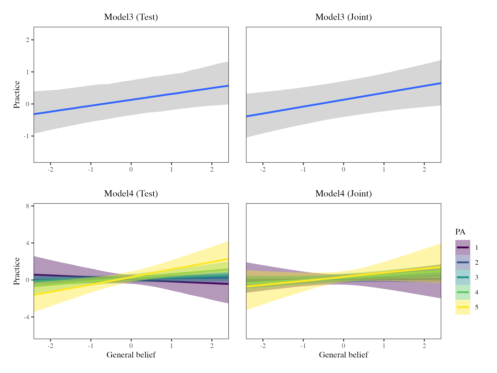
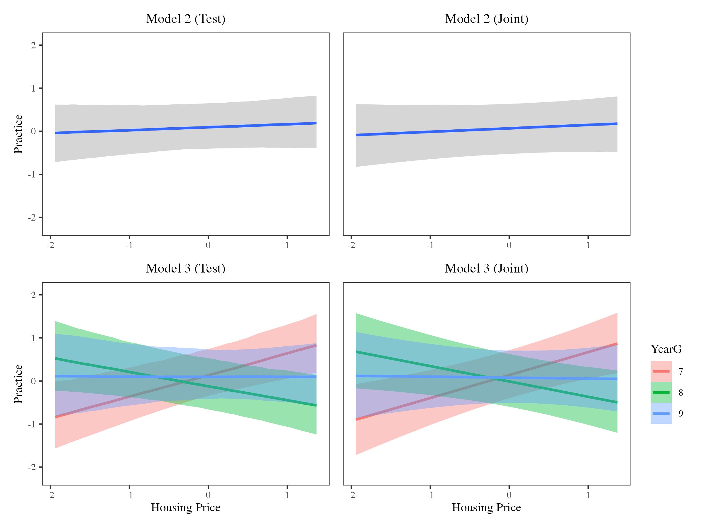

# Introduction

For global mathematics education reform agendas, there is a broad consensus among major international standards organizations that mathematics education should adopt an empowering model that connects abstract concepts with learners' lived experiences and real-world problem-solving [e.g., NCTM, -@nationalcouncilofteachersofmathematicsnctm2000princi; OECD, -@organisationforeconomicco-operationanddevelopmentoecd2023pisa]. Within public policy and educational research, such connectionist approaches are widely regarded as indicative of more desirable classroom practices, as they promote deeper conceptual understanding, support the development of positive mathematical identities among diverse learners, reduce mathematics anxiety, and prepare students for the complex problem-solving demands of contemporary society [@boaler1998open]. This global consensus positions classroom reform not merely as a pedagogical preference, but as a necessary response to evolving societal demands, demands that traditional, teacher-centered, transmissionist approaches struggle to address.

Despite this consensus, a fundamental contradiction exists regarding the drivers of teachers' pedagogical choices and actions. Two competing explanatory frameworks dominate this discussion. The first centers on agency, positioning teachers' beliefs as the primary determinants of instructional decisions [@goldin2009belief; @goldin2002affect; @pajares1992teache; @thompson2006teache]. This aligns with the intuitive notion that teachers consistently practice what they believe. This perspective has inspired widespread professional development initiatives and interventions aimed at transforming classroom practice by cultivating teachers' related beliefs [e.g., @hunter2020shifti; @wright2021transfa]. In contrast, structural perspectives argue that institutional constraints and socioeconomic contexts largely override teachers' personal beliefs in shaping teaching practices, to the extent that teachers inevitably serve as accomplices in contributing to schools' reproduction of various inequalities in power and structure [as critiqued by @bourdieu1990reproda]. Schools serving different socio-economic status (SES) communities consistently demonstrate different institutional priorities and encounter different accountability pressures, and teachers frequently find themselves directed to follow specific curriculum plans and instructional approaches, subtly surrendering control over their practice to more powerful actors and forces within the educational system [@nast2022bringi]. This perspective suggests that regardless of whether teachers recognize their passive position, their capacity for resistance within education systems is severely constrained. This may help explain why many well-intentioned mathematics education reform initiatives struggle during local implementation, as teachers' reform-oriented intentions can be constrained by specific institutional pressures [@leonard2014learni; @westaway2019explor].

This tension is particularly pronounced in the Chinese educational context. For decades, China's Ministry of Education has consistently advocated for educational reforms aimed at moving mathematics instruction away from traditional practices characterized by rote memorization, repetitive exercises, and competition-oriented instruction. The most recent mathematics curriculum standards introduced for the first time the "Three Capacities" as a core aim of mathematics classrooms: the capacity to observe, think about, and express the world through mathematics [MoE, -@ministryofeducationofthepeoplesrepublicofchina2022compul, pp. 5--6]. This policy emphasis signals a strengthened top-down reform expectation, that the exploration of the connections between the mathematics and the real world should become a central classroom priority. However, despite substantial investment in reform initiatives and reported successes in experimental vacuum conditions such as demonstration lessons, teaching competitions, and designated experimental schools [@zhao2020episte], mathematics classroom practice in China continues to be dominated by teacher-centered and rote-oriented instruction, particularly in socioeconomically disadvantaged schools [@dello-iacovo2009currica; @yin2012curric].

Building on this background, the present study investigates the agency-structure tension in mathematics teachers' practice within the Chinese context. We report findings from a study employing Bayesian multilevel modeling (MLM) to examine how teachers' belief systems and systemic factors are associated with self-reported connectionist practices, using questionnaire data from 155 teachers across 35 secondary schools in Wenzhou.

The paper is structured as follows. First, we review connectionist mathematics pedagogies and their potential determinants. We then describe the research context and methodological approach, followed by the presentation of the analytical results and their interpretation. Finally, we discuss the implications of these findings for (mathematics) education reform efforts.

# Literature Review and Background of the study

## Connectionist pedagogic practice in mathematics classrooms

The effectiveness of mathematics teachers' pedagogic practices can be conceptualized in multiple ways. A wide range of instructional approaches has been proposed to enhance student learning, including project-based learning [PBL, see @holmes2016explor; @kokotsaki2016projec], dialogue-based pedagogy [@williams2020compat], ethnomathematics and culturally responsive pedagogy [@greer2009cultura; @nicol2024ethnom], peer collaboration and student presentation, and instructional scaffolding [@bakker2015scaffo]. Despite their diversity, these approaches share a common intention to challenge traditional teacher-centered classrooms, in which one-way transmission of knowledge often predominates [@boaler1998open]. A substantial body of scholarship has argued that such transmissionist practices, whether explicit or implicit, limit many students from fully benefiting from mathematics [@williams2012use; @williams2016aliena].

In much of the literature, the term student-centered is frequently used to signal practices that contrast with transmissionist pedagogy. Authors (2012) further framed these ideas under the concept of connectionism, defining "more desirable" practice as occurring when: i) instruction is connected to students' own mathematical understandings, and ii) meaningful links are built within mathematical topics and between mathematics and other areas of knowledge. Their studies with UK secondary and post-secondary students validated measures of teaching practices along a continuum from transmissionism to connectionism and demonstrated systematic associations between pedagogic practices and students' (declining) mathematics dispositions. Effectively, these findings suggest that teachers' connectionist practices could significantly alleviate the decline in students' mathematics dispositions (Authors, 2012; Authors, 2016). A growing body of empirical research has also shown that connectionist practices can enhance student mathematics learning outcomes [@arbaugh2006examin; @karakus2023unders], for instance promoting positive attitudes toward mathematics [@moyer2018attitu], fostering classroom engagement, and supporting students' adaptation [@lussenhop2024mathem; @nortvedt2020numera]. Moreover, such practices have been framed as an important pedagogical expression of commitments to equity and social justice in mathematics education [@felton-koestler2019childr; @wright2022progre]. Despite this extensive evidence base regarding their benefits, the mechanisms underpinning teachers' engagement with connectionist practices remain insufficiently understood. There is limited empirical clarity regarding the extent to which mathematics teachers' use of connectionist pedagogy is shaped by individual belief systems or by broader institutional and socioeconomic conditions. Addressing this gap is essential for understanding how reform-oriented pedagogical ideals are translated into classroom practice.

## Teachers' Beliefs about equity as decision-making mechanism

Teacher beliefs are widely regarded as one of the most important predictors of classroom practice [@goldin2009belief; @goldin2002affect]. Yet, a universally accepted definition remains elusive; in this study, we adopt a commonly used and deliberately loose definition proposed by @fives2012spring: beliefs are "subjective claims that the individual accepts or wants to be true." @goldin2009belief further underscore the ontological premise that every belief must be "attached to objects of belief" (p. 3). This perspective resonates with Thompson's [-@thompson2006teache] argument concerning belief mechanisms, which suggests that, when teachers' beliefs about specific objects are appropriately identified and measured, a coherent relationship between beliefs and instructional practices should be observable.

Building on the conceptualization of beliefs as object-specific, in the domain of equity in mathematics education, @felton-koestler2017mathem introduces a "What, Who, and How" (WWH) framework for two levels of belief attached to different objects. At the most general level, teachers hold a General Belief about equity reflecting deeply held convictions about students' entitlement to support and resources necessary to reach their full mathematical potential [@tomlinson2014differa]. This general belief does not imply a simplistic notion of equality; rather, it recognizes that students, particularly those who are disadvantaged, require differentiated classroom support that affirms their identities and cultural backgrounds, and ensures that mathematics is experienced as personally and culturally meaningful [@choudry2024power]. Beyond the general level, beliefs can be further differentiated into three contextualized categories:

i) Belief about Mathematics (What): Do teachers view mathematics as a human-constructed, context-rich discipline, or as a fixed, dehumanized entity of knowledge [@ernest1989impact; @ernest1989knowle]?

ii) Belief about Learners (Who): Do teachers perceive student diversity as an asset rather than an obstacle? Do they endorse a growth-mindset view of mathematical ability [@dweck1988social], positioning the mathematics classroom as a space to resist deficit-based assumptions and affirm the diverse strengths and funds of knowledge that students bring [@gonzalez1995funds; @moll1992funds]?

iii) Belief about Pedagogy (How): Are teachers open to innovative, student-centered pedagogies, and do they believe these pedagogies can more effectively facilitate students' learning?

In this study, equity beliefs are thus conceptualized as teachers' subjective claims about equity and its various dimensions in mathematics education, claims that teachers accept or wish to be true. Drawing on belief system theory [@green1971activia; @leatham2006viewin], we further recognize that beliefs are organized into coherent systems, with some beliefs being more central in guiding instructional action, while others are more peripheral and context-sensitive.

## Questioning agency: SES as a system-determined factor

Although a large body of research on beliefs suggests that teachers can, through their professional agency, translate their beliefs into classroom practice [@arbaugh2006examin; @cerda2017effect; @dearaujo2017connec; @pozas2020teache], social reproduction theory [@bourdieu1990reproda] provides a framework for attending to the constraints that macro-level structural factors impose on teachers' decision-making. From a Bourdieusian perspective, teachers may become unwitting agents of social reproduction enacting pedagogical practices within a persistent dialectical tension between agency and structure [@harker1990introd; @harker1984reprod].

Within schooling systems, students from different SES enter the school system with unequal amounts of cultural capital[^1]. Working-class children, by virtue of their relative lack of capital, often experience schooling as alienating. This alienation can manifest as disinterest, disidentification, or withdrawal from participation [@williams2016aliena]. While these responses are shaped by structural positioning within the educational field, they may be internalized as individual deficiencies, leading students to perceive mathematics as "not for us" [@choudry2024power; @williams2016mathem].

A recent meta-analysis of 326 empirical studies and 1,230 international assessment samples with over 5 million students found a moderate positive correlation between SES and academic achievement (with $r =$ .22 - .28) and showed that this association has strengthened since the 1990s [@liu2022socioe]. These findings confirm that structural inequality remains a pervasive feature of contemporary educational systems. Building on Bourdieu, DiMaggio and Powell's [-@dimaggio1983iron] institutional theory highlights how schools are subject to normative, mimetic, and coercive pressures that produce institutional isomorphism. As a result, teachers operating under similar accountability regimes, parental expectations, and leadership structures may adopt highly similar pedagogical practices, even in the absence of direct interaction. For example, @chen2012eighth found that mathematics teachers in schools located in high-SES districts in Taiwan were more likely to use formative assessment and emphasize deep conceptual understanding, whereas those in low-SES districts relied more heavily on rote instruction and evaluation; @zhao2020episte also observed the same pattern in a case study of schools serving vulnerable migrant children in China. Likewise, Nast's [-@nast2022bringi] ethnographic study of two German schools serving different SES communities documented that teachers faced sharply different parental demands, leadership styles, and accountability pressures that led to isomorphic practice.

Despite these insights, quantitative research that directly links school-level SES and mathematics teachers' classroom practices remains limited. Addressing this gap, the present study proposes a statistical modeling approach that quantifies how teachers' beliefs are associated with their instructional practices within institutionalized spaces, where pedagogical action is negotiated through ongoing agency-structure tensions.

## The Context of this Study

This study was conducted in Wenzhou City, Zhejiang Province, China. In recent years, the city has been actively engaged in educational reform. The local education bureau has demonstrated strong interest in connectionist pedagogy, aiming to transform teachers' use of transmissionist approaches [WMPGO, -@wenzhoumunicipalpeoplesgovernmentofficewmpgo2021jichu]. During the data collection period (March to September 2024), in response to the call from the local education bureau, schools were actively carrying out project-based learning (PBL) professional development activities [WLERI, -@wenzhouluchengeducationresearchinstitutewleri2024jiaoke; -@wenzhouluchengeducationresearchinstitutewleri2024yi]. Policy encouragement for reform agendas undoubtedly poses a strong challenge to the traditional educational models prevalent in China. However, whether teachers in local practice contexts undergo effective transformations in both beliefs and practices as intended remains unknown.

Within the broader context of China's compulsory education system, school district policies have been implemented for a long time to ensure school-aged children can receive compulsory education near their homes. The government has established multiple strict policies limiting school choice to ensure the fairness of nearby enrollment. In Wenzhou, for example, the "sunshine admission" policy, introduced in 2012, required all public schools to make their enrollment plans, processes, and methods transparent and open to public supervision. Subsequently, the "zero school choice" policy in 2014 strictly prohibited schools from establishing additional barriers, such as entrance exams, for student selection.

However, in the context of high population density and constrained educational resources in Chinese cities, substantial disparities between schools persist. Parents may secure access to "better" schools by purchasing houses in more desirable school catchment areas, while high-performing school districts, in turn, are often associated with substantial appreciation in surrounding residential property values [@bogart1997how]. Substantial evidence indicates that in China, school quality has been increasingly capitalized into housing prices. For example, using transaction data from Beijing, @zheng2008land found that housing prices near high-quality schools were significantly higher; @wen2014educat analyzed housing data from 660 residential communities in Hangzhou and discovered that the quality of secondary school educational resources was significantly capitalized into the surrounding housing market, with each quality level increase accompanied by a 5.4% rise in housing prices. Similarly, @feng2013school demonstrated through a natural experiment in Shanghai that when a district's school was designated by the government as a high-quality school targeted for development, the surrounding housing prices increased by 6.9% accordingly.

This school-housing price capitalization effect exacerbates residential and schooling segregation among different SES communities within cities [@zhang2025geogra]. Accordingly, in this study, housing price is treated as a meaningful proxy for socioeconomic stratification, reflecting localized disparities in access to educational capital[^2]. Despite the well-documented association between housing prices and school quality in China, to the best of our knowledge, existing research has not examined how housing prices, as an indicator of school SES, are associated with teachers' self-reported classroom practices.

Based on this background and identified research gaps, this study addresses the following research questions (RQ):

RQ1: To what extent are secondary mathematics teachers' equity-oriented beliefs associated with their perceived enactment of connectionist teaching practices in the classroom?

RQ2: How are systemic contextual factors, such as school resources, school SES, and student year group, associated with the implementation of connectionist pedagogic practices in mathematics classrooms?

# Methods

## Data

This study selected three main urban districts in Wenzhou, Lucheng, Ouhai, and Longwan District, which together constitute the core metropolitan area of the city, as the research area. The primary data source was a self-administered questionnaire completed by secondary mathematics teachers. Data collection took place between March and September 2024, during the second semester of the academic year. Teachers were asked to report their beliefs and practices with reference to their experiences in the preceding (first) semester. During this period, all principals of public secondary schools in the region (n=46) were contacted[^3], and they helped distribute the questionnaire invitation posters to mathematics teachers in their schools. In total, 155 teachers from 35 secondary schools completed the questionnaire. This represents a sampling fraction of 76% of all public secondary schools in the research area.

The questionnaire comprised two main instruments measuring teachers' self-reported practices and equity-oriented beliefs, alongside demographic and professional background information. Educational resource data were obtained from annual reports publicly released by the local education bureau, while housing price data were collected from the Lianjia platform (lianjia.com) and were matched to schools based on their geographical location.

## Measures and other explanatory variables

### Teacher's Self-Reported Connectionist Practice

We adapted the teacher practice scale developed and validated in previous work (Authors, 2012; Authors 2016), as it was designed specifically for the connectionist-transmissionist continuum. The original questionnaire comprised 30 items, including positively coded connectionist practice-related statements and reverse-coded transmissionist practice-related statements. Teachers were asked to indicate the frequency with which they engaged in each practice using a 5-point scale (almost never, occasionally, about half the time, most of the time, almost always).

The instrument was translated into Chinese following a forward-translation process, and face validity was reviewed by the authors. The translated items were informally piloted with mathematics teacher experts to assess clarity and contextual appropriateness. Four items were ultimately removed as they were deemed either inconsistent with the Chinese mathematics classroom context or presented difficulties in preserving meaning through translation. The final adapted scale therefore consisted of 26 items (Authors, 2025).

While self-report data may be subject to social desirability bias, with teachers potentially reporting higher frequencies of connectionist practices, recent research suggests that self-reports still offer greater reliability, predictive validity, and flexibility compared to implicit measures [@corneille2024selfre; @pekrun2020selfre]. Importantly, this approach allows us to capture teachers' perceptions of their own pedagogical approaches and provides insights into their intended practices.

### Teacher's Belief about Equity

The instrument measuring equity beliefs was adapted from the Teacher Education and Development Study in Mathematics (TEDS-M) project's belief scales [@carnoy2009teachea; @tatto2013teachea]. Like the practice instrument, we selected items and performed face validity checks with mathematics teacher experts to ensure comprehensibility and accuracy of the translation. The adapted version consisted of 24 items across three dimensions: 8 items for beliefs about mathematics, 11 items for beliefs about learners, and 5 items for beliefs about pedagogy (Authors, 2025). Teachers were asked to report their endorsement level for each item, on a 5-point Likert scale (from "1" strongly disagree to "5" strongly agree; for details on the items used for beliefs and practice instrument, check Supplemental Material A).

### Other Self-Reported Demographic Variables

Teachers' perceptions of the attainment level of the class they taught were measured on a five-point scale ranging from 1 "very low" to 5 "very high." In addition, teachers reported their gender, their school, the school district (1 for "Lucheng," 2 for "Ouhai," 3 for "Longwan," ordered from lowest to highest SES level), and the year group of the class they taught (Year 7/8/9). For a small number of teachers (n = 10) with missing school affiliation, a virtual school was created and its school-level variables were imputed using the mean of all schools[^4].

### School Resource

Relevant data were extracted from publicly available district-level education bureau annual reports to estimate school resource level. Specifically, the 2023 annual reports provided school-level indicators, including annual financial expenditure, building area, and numbers of students and teachers for all public schools. Following the method proposed by @wu2020explor, a composite school resource index was constructed by calculating the standardized and weighted sum of per-student resource indicators:

$$R_{j} = w_{1} \cdot z\left( \frac{F_{j}}{S_{j}} \right) + w_{2} \cdot z\left( \frac{B_{j}}{S_{j}} \right) + w_{3} \cdot z\left( \frac{T_{j}}{S_{j}} \right)$$

where $R_{j},\ F_{j},\ B_{j},T_{j},\ S_{j}$ denote the school resource index, financial expenditure, building area, number of teachers, and number of students of school $j$, respectively, and $z( \cdot )$ represents the z-score standardization across schools. The weights were set as $w_{1} = 0.3,\ w_{2} = 0.2,$ and $w_{3} = 0.5$, following the configuration in @wu2020explor based on previous work [@chang2011explor; @rigolon2018inequi], which was also reviewed and endorsed as reasonable by the local mathematics education experts consulted.

### Housing Price

Housing price data were collected in February 2024 from Lianjia, a major online real estate platform in China. The data reflect average listing prices (per square meter) in January 2024 for second-hand residential properties located within a 1-kilometre radius of each school. For two relatively remote schools where no listings were available within 1 kilometer, the search radius was expanded to 5 kilometers. While listing prices may not represent final transaction values, they provide a consistent proxy for comparing housing market conditions across different school neighborhoods. Given the right-skewed distribution of housing prices, a logarithmic transformation was applied. This is a common procedure for processing housing price data to improve model fit and normalize data.

## Analytical Approach

### Measurement approach

For the two main instruments assessing teachers' beliefs and practices, Bayesian Item Response Theory (BIRT) was employed, with the instrument validation and calibration process documented in detail elsewhere (Authors, 2025).

For the practice scale, all reverse-coded transmissionist-related items were found to violate the unidimensional assumption of the original measure (which assumed transmissionist and connectionist practices were opposite ends of a single dimension). Psychometric analysis revealed that these constructs represent two separate dimensions rather than a single continuum for this group of teachers. Consequently, we separated the original scale into two distinct scales: transmissionist practice and connectionist practice[^5]. In this study, we focused only on the connectionist practice scale, using the remaining 18 items in a Bayesian Partial Credit Model (PCM) analysis to obtain teachers' connectionist practice latent variables.

For the equity belief scale, 4 reversely-coded items in the belief about mathematics sub-scale, representing a formalist (as opposed to equity-oriented) stance (e.g., "I believe mathematics is a collection of rules and procedures"), were found to be misfitting and were therefore removed. For the remaining 20 items, a bi-factor structured Bayesian Graded Response Model (GRM) was fitted, yielding a general belief as a common factor, along with three dimension-specific beliefs (i.e., belief about mathematics, belief about learners, belief about pedagogy). It should be noted that these dimension-specific beliefs estimate belief components that are orthogonal to the general belief, representing variance unexplained after controlling for the general belief (Authors, 2025). This statistical orthogonality inherent in the bi-factor structure effectively eliminates multicollinearity concerns when simultaneously including these belief variables as predictors in later regression analyses.

Unlike frequentist IRT, which provides only single point estimates, the two BIRT models provided complete posteriors composed of multiple independent iterations to reflect uncertainty in model fitting [@burkner2021bayesia]. From each posterior we drew eight random iterations with eight sets of plausible values for every score of teacher's practice and belief and merged each set into the original data frame, producing eight plausible datasets. We then applied five multiple imputations [with the R package mice, @vanbuuren2006mice] to each of these eight datasets, resulting in 40 complete datasets in total (Table C.1 shows the first plausible dataset's descriptive statistics and the pattern of missingness[^6].)

### Modeling Approach 

Given the nested nature of the data, with teachers clustered within schools, MLM was employed to account for the hierarchical structure. A key challenge in this study, however, concerns the potential instability of multilevel model estimation with small datasets. In most maximum likelihood (ML)-based guidance, 30 clusters (often with n ≈ 150, assuming an average cluster size of 5) serves as an admittedly arbitrary but practically useful rule of thumb for minimum sample size [@bickel2007multil; @maas2005suffic]. Samples below this threshold are often questioned for convergence problems and boundary estimates (i.e., variance components estimated as zero). Our case sits at an awkward borderline: the present study has 36 clusters (schools) with an average cluster size of approximately 5.

We therefore adopted a small-sample alternative approach, specifically Bayesian multilevel modeling with weakly informative priors. Bayesian methods address small-sample challenges through partial pooling and prior-based regularization, providing more stable estimates [@zitzmann2021perfor]. Evidence suggests that when random slopes are not estimated, Bayesian approaches can reduce the minimum cluster requirement to 20, compared to 30 for ML methods [@hox2020small]. None of our models estimate random slopes. Additionally, the Bayesian framework excels at handling complex data structures through its comprehensive approach to uncertainty quantification [@mcelreath2018statisa].

Beyond addressing small-sample concerns, Bayesian approaches offer further advantages. Unlike ML-based frequentist methods that rely on p-values and significance testing for binary decision-making, Bayesian inference provides full posterior with 95% credible intervals (CrI) distributions capturing complete uncertainty over model parameters, alongside familiar summaries akin to frequentist reporting [@gelman2013philos; @kruschke2010bayesi].

All Bayesian analyses were conducted using the brms package in R [@burkner2017brmsb]. We fitted four Bayesian multilevel models of connectionist teaching practice (with teacher as level 1, school as level 2) to both a test dataset and the joint dataset[^7]. Test models were fitted to a single dataset (the first imputation of the first plausible dataset). While test models are more variable due to reliance on a single dataset, they enable detailed examination of model specifications that are computationally challenging with joint fitting approaches. Joint models employed the brm_multiple() function to simultaneously fit models across all 40 complete datasets, producing a joint posterior that properly accounts for both measurement uncertainty from IRT modeling and missing data uncertainty from multiple imputation [@burkner2024handle]. This approach combines results using Bayesian model averaging principles [@burkner2024handle; @yao2018using]. Although joint models sacrifice flexibility in model comparison, they provide more stable and comprehensive uncertainty quantification (for additional discussion, see Supplementary Material B).

Each model was run with four Markov Chain Monte Carlo (MCMC) chains, each consisting of 500 warm-up iterations followed by 500 sampling iterations. All continuous variables were standardized to enable comparable effect sizes.

# Results

Our models demonstrated excellent performance across all diagnostic metrics, with all R̂ < 1.05 and Pareto k < 0.7, indicating good model convergence and stable parameter estimates without unreasonably wide posterior intervals. A common critique of Bayesian approaches concerns the potential influence of prior specifications on results [see @zitzmann2021perfor]. We conducted prior sensitivity analyses on Model 3, refitting both test and joint models with a narrower N (0,1) and a wider N (0,5) prior, compared to our original N (0,3) prior. Results showed minimal deviation from the original model, with all non-zero credible effects consistently maintained (see Supplementary Material C, Table C.4). This demonstrates that results are primarily driven by observed data rather than choice of priors, indicating that n = 155 provides sufficient information for reliable inference. Table C.2 presents the results of the four models estimated using both the test and joint datasets.

## Belief system effects

Across Models 1-3, General Belief showed a credible positive association with connectionist practice: on average, a one-*SD* increase in General Belief was associated with approximately a 0.21-*SD* increase in reported Practice (e.g., Model 3 Joint: β = 0.21, 95% CrI [0.04, 0.39], also see Figure 1).

However, in Model 4, after introducing the General Belief × Perceived Attainment interaction, the baseline main effect of General Belief was no longer credible (e.g., β = 0.00, 95% CrI [--0.78, 0.60] in Model 4 Joint). This indicates that at the baseline level where teachers perceived class attainment as very low, there was no credible association between general beliefs and connectionist practice. Interestingly, the interaction term itself showed a credible positive effect in the test model (β = 0.28, 95% CrI [0.06, 0.55]), suggesting that each one-level increase in perceived attainment would boost the slope of General Belief by roughly 0.28. As demonstrated in Figure 1, this pattern implies that teachers exhibited stronger belief-practice associations when teaching classes they perceived as having higher attainment levels[^8]. Yet when pooling across all 40 imputed datasets, that interaction CrI widened to include zero (β = 0.12, 95% CrI [--0.20, 0.47]), indicating that this conditional effect does not robustly replicate once full imputation uncertainty is accounted for (see Figure 1).

{#fig-pa width="90%"}

In the test Models 2-4, Belief about Pedagogy exhibited small but credible positive associations with Connectionist Practice. However, in the Joint models, the 95% CrIs for this effect consistently included zero, indicating that the association was no longer credible once full imputation uncertainty was accounted for. Likewise, Belief about Mathematics and Belief about Learners never demonstrated credible associations with Connectionist Practice in any of the four Joint models. In other words, apart from General Belief, none of the dimensional-specific belief facets showed a credible association with Connectionist Practice once imputation uncertainty was fully accounted for.

## Housing price effects

Housing Price alone showed no credible association with Connectionist Practice in Models 1 and 2. However, after introducing the housing price × Year Group interaction in Models 3 and 4, a clear pattern emerged. Figure 2 (also see table C.3) demonstrate these year‐specific slopes. In the Joint Model 3, the baseline effect of housing price for Year 7 was positive and credible (β = 0.53, 95% CrI [0.22, 0.85]). For Year 8, the marginal effect shifted to a credible negative association (β = --0.36, 95% CrI [--0.66, --0.05]), while for Year 9 the effect was not credible. Joint Model 4 showed the same turning-point pattern, positive for Year 7, negative for Year 8, and null for Year 9, indicating that the association between neighborhood housing prices and teachers' connectionist practices is critically contingent on the year group taught.

{#fig-housing width="90%"}
## Other covariates and between-school variance

Across all four Joint models, none of the remaining Level-1 or Level-2 covariates showed stable, credible associations with Connectionist Practice. Specifically, the 95 % CrIs for Gender, District, and School Resources included zero in every model.

The estimated SD of the school-level random intercepts was approximately 0.18 (e.g., SD = 0.18, 95 % CrI [0.01, 0.37] in Model 3 Joint). In substantive terms, while there is some residual heterogeneity across schools, its magnitude is comparable to, or smaller than, the effects associated with key predictors such as General Belief and Housing Price for Year 7 or Year 8.

# Discussion

This study examined the associations between mathematics teachers' beliefs, systemic contextual factors, and the enactment of connectionist teaching practices using Bayesian multilevel modeling, drawing on data from 155 secondary mathematics teachers in China. This is, to our knowledge, the first application of Bayesian multilevel modeling in the context of (mathematics) education research.

The findings indicate that teachers' general equity-oriented beliefs show a credible positive association with self-reported connectionist practices, suggesting that teachers with stronger equity beliefs are more likely to report engaging in connectionist practices. In contrast, other dimension-specific beliefs did not demonstrate stable, credible associations with connectionist practice. Furthermore, the influence of housing prices around schools on teachers' practice is moderated by year group, presenting a year-specific pattern: For Year 7, the higher the surrounding housing prices, the more likely teachers at that school are to use connectionist practices; for Year 8, this association reverses, with high housing prices associated with teachers' low connectionism tendency; for Year 9, housing price is no longer a credible predictor for teaching practices.

## Association between belief system and connectionist practice

Our findings contribute to the long-standing debate concerning whether - and under what conditions - teachers' beliefs are associated with their pedagogic practice [@pajares1992teache; @thompson1984relati]. We found that general beliefs about equity, that is the extent to which teachers believe in inclusive ideas such as the view that every student should benefit from mathematics classrooms [@felton-koestler2017mathem], are consistently associated with higher levels of self-reported connectionist practice in everyday instruction. This pattern aligns with previous research suggesting that stronger equity-oriented beliefs are associated with a greater likelihood of teachers employing pedagogical practices, such as group collaboration, inquiry-based projects, and authentic contextual tasks in their classrooms [e.g., @arbaugh2006examin; @cerda2017effect; @pozas2020teache].

However, after accounting for general belief, none of the dimensional-specific beliefs (i.e., belief about mathematics, belief about learners, belief about pedagogy) showed credible associations with connectionist practices in the multilevel models. This pattern is consistent with the core-peripheral hypothesis proposed in Belief-System Theory [@green1971activia; @leatham2006viewin], which posits that central beliefs provided stable guidance for teacher practice, while more specific, peripheral beliefs are more context- sensitive, and therefore more likely to have their effects (statistically) absorbed by core beliefs. These findings also raise an implicit methodological challenge for studies that focus exclusively on those sub-beliefs; without simultaneously modeling core belief dimensions, it becomes difficult to determine whether observed associations genuinely reflect the influence of a specific sub-belief or whether that sub-belief merely serves as a proxy for broader, unmeasured belief commitments. Future quantitative research would benefit from explicitly incorporating both core and peripheral beliefs within the same analytic models to adequately determine which truly drives pedagogic practice.

The test model revealed an interaction effect worth exploring: teachers' general beliefs had stronger positive effects on connectionist practices when they perceived their classes as higher-achieving; yet the pattern also points to potential negative belief-practice effect when they perceived their classrooms as low achieving (e.g. see Figure 1). This interaction pattern is also observed in other studies, though through potentially different causal pathways. For example, Bostwick et al.'s [-@bostwick2020teache] study of 91 mathematics teachers in Australia, found that teachers' growth mindset significantly enhanced classroom engagement only when the class as a whole demonstrated a clear "growth-oriented atmosphere". With a sample of 79 secondary teachers in Canada, @archambault2012teache also reported that while teachers' beliefs generally had a positive impact on students, high-achieving students often benefited the most. While these studies focused on student outcomes rather than teaching practices, they suggest a potential parallel mechanism: the effects of teachers' beliefs may depend on supportive classroom conditions to translate effectively into instructional decisions. If confirmed in future research, this mechanism could represent the first step in a causal chain where teachers' beliefs, combined with perceived favourable classroom conditions (such as higher-achieving students), shape the adoption of connectionist practices, which in turn influence student outcomes. However, our study does not provide sufficient evidence to confirm the stable existence of this pattern. Future research should investigate how classroom environment moderates the translation of teachers' beliefs into connectionist practices using larger samples, longitudinal designs, experimental approaches and a broader range of belief constructs.

## Association between SES and connectionist practice

Our multilevel estimates reveal year group-specific variation in the SES association with reported connectionist teaching practices: housing price in the school area is positively associated with connectionist practice in Year 7 (β ≈ 0.53), reverses to a negative association in Year 8 (β ≈ --0.36) and becomes non-credible in Year 9. Below we interpret this pattern drawing on existing literature and our understanding of shadow education, parent expectations and school accountability in China.

*Year 7*, *"low-stakes exploration"*: In the first year of junior secondary school academic pressure is relatively light. High-SES schools, equipped with abundant material and professional resources, often adopt connectionist practices as these are seen as both educationally promising and reputationally advantageous. The public display of group work, project-based learning and open inquiry allows these schools to project an "innovative" ethos that augments their symbolic capital, a resource they then use to attract and retain other high-SES families. @kenway2017elite characterize this tactic as a form of defensive moral embellishment, often adopted by elite schools by selectively mobilizing egalitarian rhetoric ("collaboration," "voice," "inclusion") to divert attention from their class exclusivity while reinforcing their market position to attract families with class ambitions. Low-SES schools face a different starting point. They typically enroll large numbers of migrant or academically under-prepared students whose families can offer little educational capital [@jin2017family; @liu2013access; @zhao2020episte]. Their priorities in Year 7 are, thus, to close foundational gaps and secure basic classroom order. Under these constraints, leadership teams and teachers often regard traditional transmissionist routines as the safest, most immediately effective option, and therefore employ connectionist activities far less frequently.

*Year 8*, *"achievement-leap window":* High SES schools may treat Year 8 as an 'achievement-leap window' with heightened grade pressure, characterized by intense parental monitoring of test scores, stricter accountability metrics, and substantial investment in shadow education [private tutoring and supplementary education outside formal schooling, which is ubiquitous in China, see @zhang2014demand]. The reliance on shadow education to meet students' learning needs, combined with the intense emphasis on high-stakes academic results, may create pressures on schools and families that effectively compel teachers to reduce inquiry-based activities in the classroom, prioritizing practice-intensive, test-focused approaches instead. A recent study in Zhengzhou, China shows that shadow education institutions form a core-edge structural feature spreading from urban centers to peripheries, indicating high SES school and community's enormous demand for it [@luo2024spatia]. Elsewhere, @lynch2006market discuss how middle-class families in Ireland outsource educational needs to satisfy their competitive expectations for their children. In low-SES schools, although there is also a broad pursuit of scores, parental expectations are generally more moderate and less interventionist in teachers' instructional decisions. Seghers et al.'s [-@seghers2021classe] research on parent-teacher relationships in Belgium found that middle-class parents communicate with schools from positions of power and assertiveness, while working-class and immigrant parents exhibit more restraint and invisibility. Furthermore, unlike high SES schools' focus on individuals gaining advantages in academic competition, low SES schools in Year 8 may focus more on preventing large numbers of students from giving up on mathematics. Thus, connectionism may become a rational choice that keeps students engaged.

*Year 9, "high-stakes convergence":* Year 9 marks the test preparation phase for the Zhongkao (the high school entrance examination taken at the end of Year 9), with parents and schools aware that additional interventions yield diminishing returns as students' academic performance has largely stabilized. At this point, the connection between SES and teachers' practice disappears, becoming more a product of individual teachers or classroom dynamics.

Another possible explanation relates to measurement, although this may sound concerning: there is a possibility that our scale may have difficulty distinguishing between genuine connectionist pedagogy and what might be termed deficit-oriented practices disguised as progressive practice. In this case, in low-SES contexts, teachers might engage in what appears to be student-centered teaching, allowing extensive unstructured time, prioritizing student talk and social interaction, or reducing academic demands, while actually avoiding the intellectual rigor that genuine connectionist pedagogy requires [@haberman2010pedago]. As @delpit1988silenca noted, some progressive approaches can inadvertently disadvantage students from marginalized backgrounds when they lack explicit skill instruction alongside process-oriented learning. Then high connectionism scores in low SES schools may reflect not rigorous pedagogy but instructional simplification and lower expectations to prevent marginal students from developing aversion to learning [@hewitson2007climbi]. In Australia, this ostensibly student-centered approach has been shown to exclude large marginalized groups, including Indigenous students, from better educational opportunities, preventing them from gaining comprehensive and rigorous academic knowledge [@comber2004gettin].

Overall, a reasonable explanation could be the combined effect of three forces: parent expectations, shadow education markets, and institutional isomorphic pressure from schools, resulting in SES differences in teachers' practices moderated by year group. These SES-driven structural differences might even override teachers' individual agency expressed through their beliefs. This may provide a possible social reproduction picture [@bourdieu1990reproda]: high SES schools practice connectionist pedagogy when risks are lowest to harvest symbolic capital, then move away from connectionist practice during periods when score gains are most achievable for students to consolidate competitive advantages; meanwhile, in disadvantaged schools, where students lack educational resource and external tutoring, schools may strategically opt in connectionism as a survival rule to prevent children from giving up mathematics. Teachers' beliefs clearly afford them some agency to adopt connectionist practices; however, the impact of this belief-driven agency is limited when weighed against the stronger, SES-linked structural constraints identified in our models. It should be noted that these are speculative interpretations based on our quantitative results and require further research, particularly qualitative studies, to explore further.

# Conclusion: Contribution, limitations and implications

This study used Bayesian MLM to examine mathematics teachers' self-reported use of connectionist practices and their associated factors. Self-report measures may be subject to social desirability bias, as teachers could overestimate their use of connectionist practices. Nevertheless, such measures remain widely used for capturing teachers' pedagogical orientations and professional intentions. Although the sample included 155 teachers, these were drawn from 35 of the 46 public secondary schools (76%) in the core metropolitan area, providing broad coverage of the local population. While this strengthens contextual relevance, caution is warranted when extending findings to other settings. The study also illustrates how Bayesian approaches can address the small sample sizes common in educational research by supporting careful inference under uncertainty.

The positive, albeit modest, association between general equity beliefs and connectionist practice suggests that belief-related factors remain relevant for pedagogical enactment. This carries implications for future interventions and professional development. In particular, it indicates that professional development may benefit from engaging with teachers' underlying equity orientations alongside instructional strategies. Supporting teachers in translating broadly held beliefs about students' mathematical potential into classroom practice may be more sustainable than promoting isolated innovations targeting broad reform agendas.

Finally, interpreted through Bourdieu's lens, the findings highlight how teacher agency operates within structural constraints. Teachers appear to enact their beliefs, but within institutional contexts shaped by socioeconomic conditions and organizational pressures. This perspective encourages reform efforts to consider both teacher learning and the structural environments in which teaching occurs, thereby sharing the responsibility for change. Teachers likely have far less classroom autonomy than reform initiatives assume, making it difficult to achieve sustainable transformation in a structural vacuum. Future research should further investigate the dynamic relationships among teacher beliefs, school structures, and classroom teaching practices.

[^1]: Here, cultural capital refers to the knowledge, habits, and ways of thinking that are valued within the school environment [@williams2016mathem].

[^2]: Survey-based SES measures, such as self-reported parental income or education level, are commonly used in large-scale studies but rely on respondent disclosure. Housing prices, as an objective geographic indicator, are not subject to such reporting limitations. Moreover, in our context, public schools within a single city where enrollment is strictly determined by residential location, housing prices directly reflect the socioeconomic stratification that shapes school composition, making it a more sensitive proxy for between-school SES variation.

[^3]: Excluding nine-year integrated schools, special schools, and specialized schools. In the Chinese education system, these excluded school types serve distinct purposes: (1) *Nine-year integrated schools* combine primary and secondary education (grades 1-9) in a single institution with continuous enrollment, making teacher practices less comparable to standard secondary schools; (2) *Special schools* cater to students with disabilities or special educational needs; and (3) *Specialied schools* include vocational schools, arts schools, sports schools, or schools with specific curricular focuses that differ substantially from the general academic curriculum. These schools were excluded to maintain sample homogeneity and ensure comparability of teaching contexts.

[^4]: It should be acknowledged that assuming all these teachers belong to a single "average" virtual school is not an ideal solution. This approach may dilute or even obscure potential school-level effects, as the unique characteristics of their actual school are not captured. However, given the small number of cases involved and the lack of reliable information on their true school affiliations, this pragmatic treatment was adopted to avoid excluding their data entirely from the analysis.

[^5]: For a detailed account of the construction process of the two instruments, see the technical report available at [authors' github]

[^6]: Technically, the most faithful Bayesian approach would be to fit the IRT and MLM jointly within a single model, allowing for full propagation of latent variable uncertainty. However, to our knowledge, current modeling frameworks in brms do not yet support efficient syntax for passing latent variables between models, and even implementing such a fully joint model in Stan would require prohibitive computational resources. Therefore, we adopted a pragmatic two-step Bayesian approach. We first fit two separate BIRT models, then capture the uncertainty from the first step by randomly drawing plausible values from the posterior distributions, which are then passed to the subsequent analysis. Similar procedures are widely used in large-scale international assessments such as PISA, where multiple imputation is employed to sample plausible values from IRT models in order to account for uncertainty [see examples in OECD, -@organisationforeconomicco-operationanddevelopmentoecd2024pisa]. In practice, this approach is preferable to the naïve frequentist solution, which only obtains and transmits single point estimates between models. Its advantages in uncertainty representation and bias reduction will also be reflected in the subsequent analyses.

[^7]: All models include gender and year group at the teacher level, and resource, housing price, and district at the school level, while Model 1 adds general belief; Model 2 adds all belief components; Model 3 adds the interaction between general belief and perceived attainment level; Model 4 adds the interaction between housing price and year group.

[^8]: We specified Perceived Attainment as a monotonic effect in brms, meaning it was modelled as a latent continuous variable with a consistent (but not necessarily equal) stepwise effect, rather than as a standard categorical (factor) variable.

# Appendix A: Items used in the belief and practice instruments

P_1        I introduce a new topic by first determining what the
             students already know about it.

  P_2_r\*    I offer content matter in gradually increasing levels of
             complexity.

  P_3        I jump between topics as the needs arise.

  P_4        I have my students work collaboratively in pairs.

  P_5        I have my students work collaboratively in groups.

  P_6        I teach each student differently according to individual
             needs.

  P_7        I encourage students to discuss the mistake they make.

  P_8        Students work on extended mathematics investigations or
             projects.

  P_9        Students work on projects in which subject material from
             various subjects is integrated.

  P_10       Students make formal presentations to the rest of the class.

  P_11_r\*   Students start with easy questions and work up to hard
             questions.

  P_12       Students use mathematics concepts to interpret and solve
             applied problems.

  P_13       Students play mathematical games.

  P_14_r\*   Students work through exercises from textbooks or worksheets.

  P_15_r\*   Students work on their own, consulting a neighbour from time
             to time.

  P_16       I choose examples that appeal to students.

  P_17       I try to indicate the value of each lesson topic for future
             use.

  P_18       I encourage students to make connections to mathematical
             concepts that may be encountered in other areas of the
             curriculum.

  P_19       When a student asks a question, I give a clue instead of the
             correct answer.

  P_20_r\*   Students use only the methods I teach them.

  P_21_r\*   During instruction I ask a lot of short questions to check
             whether students understand the content matter.

  P_22       I ask students to explain their reasoning when giving an
             answer.

  P_23       I encourage students to explore alternative methods for
             solution.

  P_24_r\*   I avoid students making mistakes by explaining things
             carefully first.

  P_25_r\*   I go through only one method for doing each question.

  P_26       I allow students to work at their own pace., , , , , , , , , , , , , , , , , , , , , , , , **Note:** The items used in the practice instrument. Teachers were asked
to report the frequency with which they implement each practice using a
5-point Likert scale ranging from 1 ("Almost never") to 5 ("Almost
always"). Items marked with \_r indicate reverse-coded items. Items
marked with \* were removed during the validation process., , , , , , , , , , , , , , , , , , , , , , , , Item ID    Statement, , , -, , , , , , , , , , , , , , , , , , , , -
  Ba_1_r\*   Mathematics is a collection of rules and procedures.

  Ba_2_r\*   Mathematics involves remembering and applying definitions,
             formulas, mathematical facts and procedures.

  Ba_3_r\*   To do mathematics requires much practice of correct
             application of routines.

  Ba_4_r\*   When solving mathematical tasks you need to know the correct
             procedure in advance.

  Ba_5       Mathematics involves creativity and new ideas.

  Ba_6       Many aspects of mathematics have practical relevance.

  Ba_7       Mathematics helps solve everyday problems and tasks.

  Ba_8       In mathematics many things can be discovered and tried out by
             oneself.

  Bb_1_r     Students must be able to solve mathematics problems quickly.

  Bb_2       Students must be able to understand why the answer is
             correct.

  Bb_3_r     Students learn mathematics best by attending to the teacher's
             standard explanations.

  Bb_4_r     For students, non-standard procedures can interfere with
             learning the correct procedure.

  Bb_5       Students can figure out a way to solve mathematical problems
             without a teacher's help.

  Bb_6_r     Only the more able students can participate in mathematics
             activities.

  Bb_7_r     To be good at mathematics one needs to be talented.

  Bb_8_r     Among other forms of talent, mathematical talent is
             relatively fixed.

  Bb_9_r     Boys tend to be more talented in mathematics than girls.

  Bb_10_r    Attention to mathematically weak students can interfere with
             the learning experience of other students.

  Bb_11_r    Attention to mathematically talented students can interfere
             with the learning experience of other students.

  Bc_1_r     Innovative pedagogy (e.g., project-based learning, flipped
             classroom) is not worth the time and expense.

  Bc_2_r     Innovative pedagogy (e.g., project-based learning, flipped
             classroom) should only play a minor, supplementary role in
             the mathematics classroom.

  Bc_3       I'm continuously seeking better ways to teach mathematics.

  Bc_4       Teachers should help students using mathematics to critically
             analyse the world.

  Bc_5       Discussion of social issues should be involved in the maths
             classroom., , , , , , , , , , , , , , , , , , , , , , , , **Note:** The items used in the belief about equity instrument. Teachers
were asked to indicate their level of agreement with each statement
using a 5-point Likert scale ranging from 1 ("Strongly disagree") to 5
("Strongly agree"). Items are grouped into three dimensions: Ba (Beliefs
about Mathematics), Bb (Beliefs about Learners), and Bc (Beliefs about
Pedagogy). Items marked with \_r indicate reverse-coded items. Items
marked with \* were removed during the validation process.

# Appendix B: Test model and joint model (model averaging under multiple imputation)

**Model Averaging & handling uncertainty**

In the main article, we presented results from the so-called "test
model," which was fitted to the No. 1 imputed dataset. While this is a
common approach and provides a concrete example, it is ultimately just
one possible scenario among many.

When working with educational data, especially after multiple
imputation or generating plausible values from IRT models, we often end
up with not just one, but many complete datasets. This naturally raises
an important question: Which results should we trust? How much do
findings depend on our choice of dataset?

To illustrate this, in this supplementary document, I present the
results of Models 2--4 fitted to test datasets No. 10 and No. 30. By
comparing these test models to each other, and to the joint model that
pools information across all 40 imputed datasets via Bayesian model
averaging, we can see how certain effects vary, or even disappear, once
we account for the full range of data uncertainty.

Some effects that look strong and credible in individual test models do
not persist in the joint model. This is not a flaw, but rather a
strength: it shows that these effects are not stable across all
plausible datasets. Once we average across the full range of data
uncertainty, only the effects that are truly consistent remain. The
joint model thus gives us a more honest and reliable summary of what the
data really support.

The following sections present detailed results for Models 2--4 using
datasets No. 10 and No. 30, and discuss why some effects vanish in the
joint model. This demonstrates how model averaging protects against
over- interpreting findings that may only hold in a single version of
the data.

**Result for model 2 estimating imputed dataset 10 & 30**

In the main article, belief about pedagogy (zthetaB_C) showed a credible
positive effect in the No.1 test fit, but this effect disappeared in the
joint fit. This actually reflects the fact that, across most plausible
datasets, this effect is not consistently credible. Here, for imputed
dataset No.10, the effect is 0.10 with a 95% CI of [--0.07, 0.26],
which clearly crosses zero. For dataset No.30, the effect remains
credible at 0.18 with a 95% CI of [0.02, 0.33]. This variability
across different datasets demonstrates why averaging is necessary:
results that look robust in one version of the data may not hold more
generally., , , , , , , , , , , , , , , , , , , , , , , --
  ## Family: gaussian\
  ## ## ## ## ##\
  Links: mu = identity; sigma = identity\
  ## Formula: ztheta_P ~ zthetaB_G + zthetaB_A + zthetaB_B +
  zthetaB_C + District + Gender + YearG + zlog_hp + z_resource +
  moAttain_Lvl\
  Data: final_imputed_datasets[[10]] (Number of observations: 155)\
  Draws: 4 chains, each with iter = 1000; warmup = 500; thin = 1;\
  total post-warmup draws = 2000\
  ## Multilevel Hyperparameters:\
  1\
  ## ~Sch_ID (Number of levels: 36)\
  ## Estimate Est.Error l-95% CI u-95% CI Rhat Bulk_ESS Tail_ESS\
  ## sd(Intercept) 0.12 0.09 0.01 0.34 1.00 857 745\
  ##\
  ## Regression Coefficients:\
  ## Estimate Est.Error l-95% CI u-95% CI Rhat Bulk_ESS Tail_ESS\
  ## Intercept 0.07 0.28 -0.45 0.66 1.00 1339 1107\
  ## zthetaB_G 0.25 0.09 0.08 0.42 1.00 2425 1160\
  ## zthetaB_A 0.01 0.08 -0.15 0.18 1.01 3090 1302\
  ## zthetaB_B -0.08 0.09 -0.25 0.08 1.00 2172 1270\
  ## zthetaB_C 0.10 0.08 -0.07 0.26 1.00 3506 1701\
  ## District2 -0.21 0.23 -0.64 0.23 1.00 2052 1399\
  ## District3 -0.17 0.22 -0.60 0.25 1.00 1695 1496\
  ## Gender2 -0.01 0.16 -0.31 0.32 1.00 3313 1662\
  ## YearG2 -0.09 0.19 -0.46 0.27 1.00 2451 1695\
  ## YearG3 -0.15 0.21 -0.55 0.26 1.00 2239 1561\
  ## zlog_hp 0.13 0.10 -0.08 0.34 1.00 1788 1268\
  ## z_resource -0.08 0.13 -0.33 0.17 1.00 2052 1364\
  ## moAttain_Lvl 0.06 0.10 -0.16 0.26 1.00 1061 776\
  ##\
  ## Monotonic Simplex Parameters:\
  ## Estimate Est.Error l-95% CI u-95% CI Rhat Bulk_ESS Tail_ESS\
  ## moAttain_Lvl1[1] 0.26 0.19 0.01 0.71 1.00 1960 1318\
  ## moAttain_Lvl1[2] 0.23 0.17 0.01 0.65 1.00 2270 1161\
  ## moAttain_Lvl1[3] 0.25 0.19 0.01 0.69 1.00 1940 1225\
  ## moAttain_Lvl1[4] 0.26 0.19 0.01 0.71 1.00 2128 1405\
  ##\
  ## Further Distributional Parameters:\
  ## Estimate Est.Error l-95% CI u-95% CI Rhat Bulk_ESS Tail_ESS\
  ## sigma 0.98 0.06 0.87 1.11 1.00 3215 1101\
  ##\
  ## Draws were sampled using sampling(NUTS). For each parameter,
  Bulk_ESS\
  ## and Tail_ESS are effective sample size measures, and Rhat is the
  potential\
  ## scale reduction factor on split chains (at convergence, Rhat = 1)., , , , , , , , , , , , , , , , , , , , , , , --, , , , , , , , , , , , , , , , , , , , , , , --, , , , , , , , , , , , , , , , , , , , , , , --
  ## Family: gaussian\
  ## Links: mu = identity; sigma = identity\
  ## Formula: ztheta_P ~ zthetaB_G + zthetaB_A + zthetaB_B +
  zthetaB_C + District + Gender + YearG + zlog_hp + z_resource +
  moAttain_Lvl\
  ## Data: final_imputed_datasets[[30]] (Number of observations:
  155)\
  ## Draws: 4 chains, each with iter = 1000; warmup = 500; thin = 1;\
  ## total post-warmup draws = 2000\
  ##\
  ## Multilevel Hyperparameters:\
  ## ~Sch_ID (Number of levels: 36)\
  ## Estimate Est.Error l-95% CI u-95% CI Rhat Bulk_ESS Tail_ESS\
  ## sd(Intercept) 0.12 0.10 0.00 0.36 1.01 739 524\
  ##\
  ## Regression Coefficients:\
  ## Estimate Est.Error l-95% CI u-95% CI Rhat Bulk_ESS Tail_ESS\
  ## Intercept 0.18 0.28 -0.39 0.74 1.00 2728 1558\
  ## zthetaB_G 0.20 0.08 0.03 0.35 1.00 1498 1292\
  ## zthetaB_A 0.02 0.08 -0.15 0.19 1.00 2007 1518\
  ## zthetaB_B 0.04 0.08 -0.11 0.22 1.00 2644 1484\
  ## zthetaB_C 0.18 0.08 0.02 0.33 1.00 2193 1522\
  ## District2 -0.26 0.22 -0.68 0.16 1.00 1697 1613\
  ## District3 -0.15 0.22 -0.58 0.27 1.00 1406 1540\
  ## Gender2 0.00 0.16 -0.33 0.32 1.00 2826 1561\
  ## YearG2 -0.27 0.19 -0.63 0.11 1.00 2171 1719\
  ## YearG3 -0.16 0.21 -0.56 0.25 1.00 1877 1565\
  ## zlog_hp 0.06 0.11 -0.15 0.26 1.00 1587 1487\
  ## z_resource -0.04 0.13 -0.30 0.21 1.00 1847 1376\
  ## moAttain_Lvl 0.03 0.10 -0.18 0.22 1.00 1208 928\
  ##\
  ## Monotonic Simplex Parameters:\
  ## Estimate Est.Error l-95% CI u-95% CI Rhat Bulk_ESS Tail_ESS\
  ## moAttain_Lvl1[1] 0.28 0.19 0.02 0.70 1.00 1992 1237\
  ## moAttain_Lvl1[2] 0.23 0.18 0.01 0.65 1.00 2044 1086\
  ## moAttain_Lvl1[3] 0.22 0.17 0.01 0.66 1.00 2244 1731\
  ## moAttain_Lvl1[4] 0.26 0.20 0.01 0.71 1.00 1888 1351\
  ##\
  ## Further Distributional Parameters:\
  ## Estimate Est.Error l-95% CI u-95% CI Rhat Bulk_ESS Tail_ESS\
  ## sigma 0.98 0.06 0.88 1.10 1.00 2404 1607\
  ##\
  ## Draws were sampled using sampling(NUTS). For each parameter,
  Bulk_ESS\
  ## and Tail_ESS are effective sample size measures, and Rhat is the
  potential\
  ## scale reduction factor on split chains (at convergence, Rhat = 1)., , , , , , , , , , , , , , , , , , , , , , , --, , , , , , , , , , , , , , , , , , , , , , , --

**Result for model 3 estimating imputed dataset 10 & 30**

A similar pattern occurs in Model 3. For both test fits (No.10 and
No.30), the effect of zthetaB_C is not credible, even though the main
article's No.1 test fit indicated a credible effect., , , , , , , , , , , , , , , , , , , , , , , --
  ## Family: gaussian\
  ## Links: mu = identity; sigma = identity\
  ## Formula: ztheta_P ~ zthetaB_G + mo(Attain_Lvl) + District +
  Gender + zthetaB_A + zthetaB_B + zthetaB_C + YearG + zlog_hp +
  z_resource + zlog_hp:YearG\
  ## Data: final_imputed_datasets[[10]] (Number of observations:
  155)\
  ## Draws: 4 chains, each with iter = 1000; warmup = 500; thin = 1;\
  ## total post-warmup draws = 2000\
  ##\
  ## Multilevel Hyperparameters:\
  ## ~Sch_ID (Number of levels: 36)\
  ##. Estimate Est.Error l-95% CI u-95% CI Rhat Bulk_ESS Tail_ESS\
  ## sd(Intercept) 0.15 0.11 0.01 0.40 1.01 679 850\
  ##\
  ## Regression Coefficients:\
  ##. Estimate Est.Error l-95% CI u-95% CI Rhat Bulk_ESS Tail_ESS\
  ## Intercept 0.14 0.28 -0.39 0.78 1.00 1004 572\
  ## zthetaB_G 0.25 0.08 0.09 0.41 1.00 2466 1598\
  ## District2 -0.27 0.21 -0.69 0.15 1.00 2104 1513\
  ## District3 -0.23 0.22 -0.64 0.20 1.00 1642 1448\
  ## Gender2 -0.00 0.15 -0.32 0.30 1.00 2817 1526\
  ## zthetaB_A 0.07 0.08 -0.09 0.22 1.00 3333 1429\
  ## zthetaB_B -0.05 0.08 -0.20 0.11 1.00 3300 1652\
  ## zthetaB_C 0.14 0.08 -0.01 0.30 1.00 2748 1686\
  ## zlog_hp 0.65 0.14 0.37 0.91 1.00 1735 1425\
  ## YearG2 -0.10 0.17 -0.43 0.23 1.00 2754 1583\
  ## YearG3 -0.12 0.19 -0.50 0.26 1.00 2723 1411\
  ## z_resource -0.08 0.13 -0.34 0.18 1.00 1993 1190\
  ## zlog_hp:YearG2 -1.03 0.19 -1.39 -0.66 1.00 2037 1622\
  ## zlog_hp:YearG3 -0.61 0.21 -1.02 -0.22 1.00 2328 1645\
  ## moAttain_Lvl 0.04 0.10 -0.20 0.22 1.00 758 582\
  ##\
  ## Monotonic Simplex Parameters:\
  ## Estimate Est.Error l-95% CI u-95% CI Rhat Bulk_ESS Tail_ESS\
  ## moAttain_Lvl1[1] 0.26 0.20 0.01 0.73 1.00 1138 1025\
  ## moAttain_Lvl1[2] 0.22 0.17 0.01 0.63 1.00 2327 1224\
  ## moAttain_Lvl1[3] 0.25 0.18 0.01 0.67 1.00 1111 1489\
  ## moAttain_Lvl1[4] 0.28 0.20 0.01 0.72 1.00 2001 1225\
  ##\
  ## Further Distributional Parameters:\
  ## Estimate Est.Error l-95% CI u-95% CI Rhat Bulk_ESS Tail_ESS\
  ## sigma 0.89 0.06 0.78 1.02 1.01 2275 1350\
  ##\
  ## Draws were sampled using sampling(NUTS). For each parameter,
  Bulk_ESS\
  ## and Tail_ESS are effective sample size measures, and Rhat is the
  potential\
  ## scale reduction factor on split chains (at convergence, Rhat = 1)., , , , , , , , , , , , , , , , , , , , , , , --, , , , , , , , , , , , , , , , , , , , , , , --, , , , , , , , , , , , , , , , , , , , , , , --
  ## Family: gaussian\
  ## Links: mu = identity; sigma = identity\
  ## Formula: ztheta_P ~ zthetaB_G + mo(Attain_Lvl) + District +
  Gender + zthetaB_A + zthetaB_B + zthetaB_C + YearG + zlog_hp +
  z_resource + zlog_hp:YearG\
  ## Data: final_imputed_datasets[[30]] (Number of observations:
  155)\
  ## Draws: 4 chains, each with iter = 1000; warmup = 500; thin = 1;\
  ## total post-warmup draws = 2000\
  ##\
  ## Multilevel Hyperparameters:\
  ## ~Sch_ID (Number of levels: 36)\
  ## Estimate Est.Error l-95% CI u-95% CI Rhat Bulk_ESS Tail_ESS\
  ## sd(Intercept) 0.14 0.10 0.00 0.38 1.00 710 804\
  ##\
  ## Regression Coefficients:\
  ## Estimate Est.Error l-95% CI u-95% CI Rhat Bulk_ESS Tail_ESS\
  ## Intercept 0.24 0.26 -0.27 0.74 1.00 1357 1426\
  ## zthetaB_G 0.21 0.08 0.05 0.36 1.00 2997 1670\
  ## District2 -0.33 0.21 -0.73 0.09 1.00 2322 1656\
  ## District3 -0.21 0.21 -0.61 0.21 1.00 1841 1413\
  ## Gender2 -0.01 0.16 -0.31 0.31 1.00 2813 1450\
  ## zthetaB_A 0.04 0.08 -0.12 0.20 1.00 2796 1319\
  ## zthetaB_B 0.04 0.08 -0.12 0.20 1.00 3143 1491\
  ## zthetaB_C 0.15 0.08 -0.02 0.31 1.00 3239 1375\
  ## zlog_hp 0.47 0.15 0.19 0.78 1.00 1390 1320\
  ## YearG2 -0.28 0.18 -0.61 0.07 1.00 2448 1705\
  ## YearG3 -0.13 0.20 -0.52 0.27 1.00 2563 1516\
  ## z_resource -0.04 0.12 -0.28 0.18 1.00 2421 1402\
  ## zlog_hp:YearG2 -0.84 0.20 -1.23 -0.45 1.00 1789 1663\
  ## zlog_hp:YearG3 -0.45 0.22 -0.88 -0.01 1.00 1833 1412\
  ## moAttain_Lvl 0.02 0.09 -0.19 0.21 1.00 1098 1012\
  ##\
  ## Monotonic Simplex Parameters:\
  ## Estimate Est.Error l-95% CI u-95% CI Rhat Bulk_ESS Tail_ESS\
  ## moAttain_Lvl1[1] 0.27 0.20 0.01 0.72 1.00 2030 1135\
  ## moAttain_Lvl1[2] 0.22 0.18 0.01 0.65 1.00 2446 1148\
  ## moAttain_Lvl1[3] 0.24 0.19 0.01 0.71 1.00 1890 1642\
  ## moAttain_Lvl1[4] 0.27 0.20 0.01 0.73 1.00 2013 1287\
  ##\
  ## Further Distributional Parameters:\
  ## Estimate Est.Error l-95% CI u-95% CI Rhat Bulk_ESS Tail_ESS\
  ## sigma 0.93 0.06 0.82 1.05 1.00 2396 1331\
  ##\
  ## Draws were sampled using sampling(NUTS). For each parameter,
  Bulk_ESS\
  ## and Tail_ESS are effective sample size measures, and Rhat is the
  potential\
  ## scale reduction factor on split chains (at convergence, Rhat = 1)., , , , , , , , , , , , , , , , , , , , , , , --, , , , , , , , , , , , , , , , , , , , , , , --

**Result for model 4 estimating imputed dataset 10 & 30**

In Model 4, the situation becomes even more interesting with the
interaction effect moAttain_Lvl:zthetaB_G. While the No.1 test fit
reported a credible positive effect in the main article, the effect in
No.10 is a non- credible negative, and in No.30, it is a non-credible
positive. This highlights the high degree of uncertainty and instability
for this parameter across different plausible datasets., , , , , , , , , , , , , , , , , , , , , , , --
  ## Family: gaussian\
  ## Links: mu = identity; sigma = identity\
  ## Formula: ztheta_P ~ zthetaB_G \* mo(Attain_Lvl) + zthetaB_A +
  zthetaB_B + zthetaB_C + District + Gender + YearG + zlog_hp +
  z_resource + zlog_hp:YearG\
  ## Data: final_imputed_datasets[[10]] (Number of observations:
  155)\
  ## Draws: 4 chains, each with iter = 1000; warmup = 500; thin = 1;\
  ## total post-warmup draws = 2000\
  ##\
  ## Multilevel Hyperparameters:\
  ## ~Sch_ID (Number of levels: 36)\
  ## Estimate Est.Error l-95% CI u-95% CI Rhat Bulk_ESS Tail_ESS\
  ## sd(Intercept) 0.24 0.15 0.01 0.55 1.01 487 896\
  ##\
  ## Regression Coefficients:\
  ## Estimate Est.Error l-95% CI u-95% CI Rhat Bulk_ESS Tail_ESS\
  ## Intercept 0.13 0.28 -0.42 0.69 1.00 1666 1364\
  ## zthetaB_G 0.40 0.25 -0.01 0.97 1.00 1352 1096\
  ## zthetaB_A 0.05 0.08 -0.12 0.23 1.00 3336 1449\
  ## zthetaB_B 0.04 0.08 -0.12 0.21 1.00 3101 1812\
  ## zthetaB_C 0.10 0.09 -0.07 0.27 1.00 3364 1381\
  ## District2 -0.28 0.24 -0.74 0.18 1.00 2555 1648\
  ## District3 -0.04 0.23 -0.49 0.41 1.00 2141 1491\
  ## Gender2 -0.14 0.17 -0.47 0.19 1.00 4133 1623\
  ## YearG2 -0.13 0.18 -0.48 0.22 1.00 2708 1448\
  ## YearG3 -0.02 0.20 -0.42 0.36 1.00 3249 1610\
  ## zlog_hp 0.52 0.16 0.23 0.84 1.00 1845 1512\
  ## z_resource -0.11 0.14 -0.39 0.14 1.00 2538 1830\
  ## YearG2:zlog_hp -0.83 0.21 -1.24 -0.42 1.00 1975 1409\
  ## YearG3:zlog_hp -0.48 0.24 -0.97 -0.01 1.00 2100 1608\
  ## moAttain_Lvl 0.04 0.10 -0.18 0.24 1.00 1591 1068\
  ## moAttain_Lvl:zthetaB_G -0.13 0.10 -0.36 0.05 1.00 1579 1282\
  ##\
  ## Monotonic Simplex Parameters:\
  ## Estimate Est.Error l-95% CI u-95% CI Rhat Bulk_ESS Tail_ESS\
  ## moAttain_Lvl1[1] 0.27 0.20 0.01 0.73 1.00 2704 1414\
  ## moAttain_Lvl1[2] 0.22 0.18 0.01 0.66 1.00 2659 1471\
  ## moAttain_Lvl1[3] 0.25 0.19 0.01 0.69 1.00 2122 1460\
  ## moAttain_Lvl1[4] 0.26 0.19 0.01 0.72 1.00 2655 1273\
  ## moAttain_Lvl:zthetaB_G1[1] 0.29 0.20 0.01 0.75 1.00 2354 1107\
  ## moAttain_Lvl:zthetaB_G1[2] 0.27 0.19 0.01 0.71 1.00 2461 1407\
  ## moAttain_Lvl:zthetaB_G1[3] 0.18 0.16 0.00 0.59 1.00 2750 1435\
  ## moAttain_Lvl:zthetaB_G1[4] 0.27 0.19 0.01 0.72 1.01 2464 1249\
  ##\
  ## Further Distributional Parameters:\
  ## Estimate Est.Error l-95% CI u-95% CI Rhat Bulk_ESS Tail_ESS\
  ## sigma 0.95 0.06 0.83 1.09 1.00 1649 1357\
  ##\
  ## Draws were sampled using sampling(NUTS). For each parameter,
  Bulk_ESS\
  ## and Tail_ESS are effective sample size measures, and Rhat is the
  potential\
  ## scale reduction factor on split chains (at convergence, Rhat = 1)., , , , , , , , , , , , , , , , , , , , , , , --, , , , , , , , , , , , , , , , , , , , , , , --, , , , , , , , , , , , , , , , , , , , , , , --
  ## Family: gaussian\
  ## Links: mu = identity; sigma = identity\
  ## Formula: ztheta_P ~ zthetaB_G \* mo(Attain_Lvl) + zthetaB_A +
  zthetaB_B + zthetaB_C + District + Gender + YearG + zlog_hp +
  z_resource + zlog_hp:YearG\
  ## Data: final_imputed_datasets[[30]] (Number of observations:
  155)\
  ## Draws: 4 chains, each with iter = 1000; warmup = 500; thin = 1;\
  ## total post-warmup draws = 2000\
  ##\
  ## Multilevel Hyperparameters:\
  ## ~Sch_ID (Number of levels: 36)\
  ## Estimate Est.Error l-95% CI u-95% CI Rhat Bulk_ESS Tail_ESS\
  ## sd(Intercept) 0.15 0.11 0.00 0.42 1.01 640 676\
  ##\
  ## Regression Coefficients:\
  ## Estimate Est.Error l-95% CI u-95% CI Rhat Bulk_ESS Tail_ESS\
  ## Intercept 0.17 0.28 -0.39 0.76 1.00 1104 990\
  ## zthetaB_G -0.01 0.23 -0.53 0.41 1.00 945 1095\
  ## zthetaB_A 0.02 0.08 -0.13 0.18 1.00 2697 1499\
  ## zthetaB_B 0.03 0.08 -0.12 0.18 1.00 2660 1411\
  ## zthetaB_C 0.14 0.08 -0.01 0.29 1.00 2558 1522\
  ## District2 -0.29 0.21 -0.70 0.11 1.00 1988 1319\
  ## District3 -0.21 0.21 -0.61 0.20 1.00 1419 1388\
  ## Gender2 0.03 0.16 -0.28 0.35 1.00 2824 1445\
  ## YearG2 -0.24 0.18 -0.59 0.10 1.00 1622 1435\
  ## YearG3 -0.12 0.21 -0.53 0.28 1.00 2069 1342\
  ## zlog_hp 0.48 0.14 0.20 0.76 1.00 1755 1647\
  ## z_resource -0.05 0.12 -0.29 0.20 1.00 1950 1380\
  ## YearG2:zlog_hp -0.83 0.19 -1.21 -0.47 1.00 1468 1601\
  ## YearG3:zlog_hp -0.44 0.22 -0.86 0.00 1.00 1676 1633\
  ## moAttain_Lvl 0.03 0.10 -0.19 0.23 1.01 1006 878\
  ## moAttain_Lvl:zthetaB_G 0.19 0.18 -0.09 0.57 1.00 905 1254\
  ##\
  ## Monotonic Simplex Parameters:\
  ## Estimate Est.Error l-95% CI u-95% CI Rhat Bulk_ESS Tail_ESS\
  ## moAttain_Lvl1[1] 0.28 0.21 0.01 0.73 1.00 2187 1237\
  ## moAttain_Lvl1[2] 0.21 0.18 0.01 0.66 1.00 1903 1089\
  ## moAttain_Lvl1[3] 0.23 0.18 0.01 0.67 1.00 2063 1685\
  ## moAttain_Lvl1[4] 0.27 0.20 0.01 0.74 1.00 2584 1381\
  ## moAttain_Lvl:zthetaB_G1[1] 0.22 0.18 0.01 0.66 1.00 1589 996\
  ## moAttain_Lvl:zthetaB_G1[2] 0.14 0.14 0.00 0.53 1.00 1707 1342\
  ## moAttain_Lvl:zthetaB_G1[3] 0.14 0.14 0.00 0.53 1.00 1561 1498\
  ## moAttain_Lvl:zthetaB_G1[4] 0.50 0.26 0.03 0.89 1.00 1215 1740\
  ##\
  ## Further Distributional Parameters:\
  ## Estimate Est.Error l-95% CI u-95% CI Rhat Bulk_ESS Tail_ESS\
  ## sigma 0.92 0.06 0.81 1.05 1.00 1926 1558\
  ##\
  ## Draws were sampled using sampling(NUTS). For each parameter,
  Bulk_ESS\
  ## and Tail_ESS are effective sample size measures, and Rhat is the
  potential\
  ## scale reduction factor on split chains (at convergence, Rhat = 1)., , , , , , , , , , , , , , , , , , , , , , , --, , , , , , , , , , , , , , , , , , , , , , , --

**Why Should We Report Test Model Results?**

One might ask: why not simply report the joint model results, given the
high degree of uncertainty in individual test models? In fact, there are
good reasons to include the test model results in the main text. Most
importantly, in brms it is not possible to directly compare joint models
using information criteria such as LOOIC or WAIC, these metrics are
always computed on the No.1 imputed dataset. As a result, model
comparisons (and thus model selection) are effectively based on the No.1
test model. Reporting the test model results therefore provides
essential context for interpreting model selection and understanding why
a particular model was preferred. Far from being redundant, these
results are directly relevant for readers who wish to follow the logic
behind our model comparisons.

Second, we believe that these "disappearing effects" are worth
reporting. It is likely that some of these patterns are a consequence of
limited sample size, and while they do not represent firm statistical
evidence, they might indicate potential trends or patterns that deserve
further investigation in future studies. In this sense, reporting test
model results alongside joint model results provides a fuller and more
nuanced understanding of the data.

# Appendix C: Descriptive statistics and model-results tables

Results, and Prior Sensitivity Analysis

**Table C.1:**

*Descriptive Statistics for Variables (Practice and Beliefs based on
First Set of Plausible Values)*

+, , , , , , , , , , --+, , , --+, , -+, , , , , -+
| Variable                       | *M/*      | *SD*  | Missingness    |
|                                | *prop*    |       |                |
+================================+===========+=======+================+
| **Teacher Level (n=155)**      |           |       |                |
+, , , , , , , , , , --+, , , --+, , -+, , , , , -+
| Connectionist Practice         | -0.08     | 1.16  |                |
+, , , , , , , , , , --+, , , --+, , -+, , , , , -+
| General Belief                 | 0.02      | 1.06  | 4 (2.6%)       |
+, , , , , , , , , , --+, , , --+, , -+, , , , , -+
| Belief about Mathematics       | 0.05      | 1.93  | 4 (2.6%)       |
+, , , , , , , , , , --+, , , --+, , -+, , , , , -+
| Belief about Learner           | -0.11     | 1.20  | 4 (2.6%)       |
+, , , , , , , , , , --+, , , --+, , -+, , , , , -+
| Belief about Pedagogy          | 0.33      | 1.13  | 4 (2.6%)       |
+, , , , , , , , , , --+, , , --+, , -+, , , , , -+
| Gender                         |           |       | 3 (1.9%)       |
+, , , , , , , , , , --+, , , --+, , -+, , , , , -+
| ~ Male                        | 0.44      |       |                |
+, , , , , , , , , , --+, , , --+, , -+, , , , , -+
| ~ Female                      | 0.56      |       |                |
+, , , , , , , , , , --+, , , --+, , -+, , , , , -+
| Year Group                     |           |       |                |
+, , , , , , , , , , --+, , , --+, , -+, , , , , -+
| ~ Year 7                      | 0.38      |       |                |
+, , , , , , , , , , --+, , , --+, , -+, , , , , -+
| ~ Year 8                      | 0.37      |       |                |
+, , , , , , , , , , --+, , , --+, , -+, , , , , -+
| ~ Year 9                      | 0.25      |       |                |
+, , , , , , , , , , --+, , , --+, , -+, , , , , -+
| Perceived Attainment           | 0.03      |       | 3 (1.9%)       |
|                                |           |       |                |
| ~ Level 1                     | 0.19      |       |                |
|                                |           |       |                |
| ~ Level 2                     | 0.43      |       |                |
|                                |           |       |                |
| ~ Level 3                     | 0.31      |       |                |
|                                |           |       |                |
| ~ Level 4                     | 0.04      |       |                |
|                                |           |       |                |
| ~ Level 5                     |           |       |                |
+, , , , , , , , , , --+, , , --+, , -+, , , , , -+
| **School level (n=36)**        |           |       |                |
+, , , , , , , , , , --+, , , --+, , -+, , , , , -+
| District                       |           |       | 2 (1.3%)       |
+, , , , , , , , , , --+, , , --+, , -+, , , , , -+
| ~ District 1                  | 0.42      |       |                |
+, , , , , , , , , , --+, , , --+, , -+, , , , , -+
| ~ District 2                  | 0.24      |       |                |
+, , , , , , , , , , --+, , , --+, , -+, , , , , -+
| ~ District 3                  | 0.34      |       |                |
+, , , , , , , , , , --+, , , --+, , -+, , , , , -+
| Resource                       | 0.00      | 0.75  |                |
+, , , , , , , , , , --+, , , --+, , -+, , , , , -+
| Housing Price                  | 9.44      | 0.42  |                |
+, , , , , , , , , , --+, , , --+, , -+, , , , , -+

: Table C.4.

Note: The reported data for Connectionist Practice and belief dimensions
(General Belief, Belief about Mathematics, Belief about Learner, and
Belief about Pedagogy) are based on the first of eight sets of plausible
values. Means (*M*) and standard deviations (*SD*) are reported for
continuous variables. Dummy-coded categorical variables (Gender, Year
Group, District) report the proportions (*prop*), with values ranging
from 0 to 1. Housing Price represents log-transformed values.
Missingness is presented as count (percentage) and is only reported for
variables with missing data. The sample includes one virtual school
assigned to teachers who did not report their actual school; for this
case, school-level variables were imputed using the mean values from the
other schools.

**Table C.2.**

*Bayesian Multilevel Models Predicting Teacher Connectionist Practices*

***Table C.2a.** Models with General and Specific Belief Dimensions
(Contains Models 1 and 2)*, , , , , , , , , , , , , , , , , , , , , , , , , , , , , , , , , , , , Model 1:                                      Model 2:                            
                 General                                       Belief with                         
                 belief                                        specific                            
                 only                                          dimensions, , , , --, , , -, , , --, , , -, , , --, , , , , , , --, , , -, , , --
                 Test                   Joint                  Test                     Joint      

                 Estimate   95% CrI     Estimate   95% CrI     Estimate     95% CrI     Estimate   95% CrI

  **Teacher                                                                                        
  level (L1)**                                                                                     

  General Belief **0.23**   **[0.06,   **0.21**   **[0.02,   **0.21**     **[0.04,   **0.21**   **[0.02,
                            0.39]**               0.39]**                 0.37]**               0.39]**

  Belief about                                                 0.13         [-0.03,    0.04       [-0.15,
  Mathematics                                                               0.29]                 0.23]

  Belief about                                                 0.03         [-0.13,    0.05       [-0.16,
  Learner                                                                   0.19]                 0.24]

  Belief about                                                 **0.21**     **[0.05,   0.11       [-0.10,
  Pedagogy                                                                  0.35]**               0.31]

  Gender         -0.02      [-0.34,    -0.02      [-0.36,    -0.01        [-0.34,    -0.04      [-0.38,
                            0.29]                 0.31]                   0.31]                 0.31]

  Year Group 8   -0.20      [-0.56,    -0.12      [-0.52,    -0.25        [-0.62,    -0.13      [-0.53,
                            0.19]                 0.27]                   0.12]                 0.28]

  Year Group 9   -0.05      [-0.45,    -0.08      [-0.50,    -0.07        [-0.50,    -0.08      [-0.51,
                            0.37]                 0.35]                   0.36]                 0.35]

  Perceived      0.07       [-0.17,    0.06       [-0.16,    0.04         [-0.17,    0.07       [-0.16,
  Attainment                0.26]                 0.27]                   0.24]                 0.27]

  **School level                                                                                   
  (L2)**                                                                                           

  Resource       -0.08      [-0.34,    -0.05      [-0.32,    -0.06        [-0.33,    -0.05      [-0.33,
                            0.18]                 0.22]                   0.19]                 0.22]

  Housing Price  0.10       [-0.10,    0.09       [-0.13,    0.07         [-0.14,    0.08       [-0.14,
                            0.31]                 0.30]                   0.28]                 0.30]

  District 2     -0.25      [-0.68,    -0.24      [-0.70,    -0.24        [-0.67,    -0.24      [-0.69,
                            0.20]                 0.23]                   0.21]                 0.23]

  District 3     -0.07      [-0.52,    -0.16      [-0.64,    0.00         [-0.44,    -0.14      [-0.63,
                            0.41]                 0.33]                   0.46]                 0.35]

  **Random                                                                                         
  effect (SD)**                                                                                    

  School         0.14       [0.01,     0.14       [0.01,     0.15         [0.01,     0.14       [0.01,
  Intercept                 0.43]                 0.39]                   0.42]                 0.40]

  **Model fit                                                                                      
  (test                                                                                            
  models)**                                                                                        

  Bayes R^2^     0.14       [0.07,                            0.20         [0.11,                
                            0.23]                                          0.30]                 

  LOOIC          451.1      [412.1,                           447.9        [410.3,               
                            490.1]                                         485.5], , , , , , , , , , , , , , , , , , , , , , , , , , , , , , , , , , , , : *Prior sensitivity analysis for Model 3*

***Table C.2b.** Models with Interaction Effects (Contains Models 3 and
4)*, , , , , , , , , , , , , , , , , , , , , , , , , , , , , , , , , , , , , , , , -
                      Model 3:                                          Model 4: Full                          
                      Year group                                        interaction                            
                      $\times$                                                                                 
                      housing                                                                                  
                      price, , , , , , -, , , --, , , , , , , --, , , , , , , , -, , , , , , , --, , , , Test                     Joint                    Test                       Joint       

                      Estimate    95% CrI      Estimate    95% CrI      Estimate      95% CrI      Estimate    95% CrI

  **Teacher Level                                                                                              
  (L1)**                                                                                                       

  General Belief      **0.18**    **[0.03,    **0.21**    **[0.04,    -0.27         [-1.03,     0.00        [-0.78,
                                  0.33]**                 0.39]**                   0.15]                   0.60]

  Belief about        0.12        [-0.03,     0.05        [-0.14,     0.12          [-0.03,     0.05        [-0.15,
  Mathematics                     0.28]                   0.23]                     0.26]                   0.23]

  Belief about        0.03        [-0.11,     0.03        [-0.15,     0.04          [-0.11,     0.04        [-0.14,
  Learner                         0.18]                   0.22]                     0.19]                   0.22]

  Belief about        **0.19**    **[0.03,    0.11        [-0.08,     **0.18**      **[0.02,    0.10        [-0.08,
  Pedagogy                        0.34]**                 0.29]                     0.33]**                 0.29]

  Gender              -0.02       [-0.32,     -0.05       [-0.37,     -0.01         [-0.31,     -0.04       [-0.37,
                                  0.27]                   0.27]                     0.30]                   0.29]

  Year Group 8        -0.26       [-0.58,     -0.15       [-0.53,     -0.21         [-0.55,     -0.13       [-0.51,
                                  0.10]                   0.23]                     0.12]                   0.25]

  Year Group 9        -0.03       [-0.43,     -0.06       [-0.46,     -0.06         [-0.45,     -0.06       [-0.46,
                                  0.34]                   0.35]                     0.33]                   0.34]

  Perceived           0.04        [-0.19,     0.05        [-0.17,     0.06          [-0.14,     0.07        [-0.15,
  Attainment                      0.22]                   0.24]                     0.24]                   0.27]

  **School Level                                                                                               
  (L2)**                                                                                                       

  Resource            -0.08       [-0.34,     -0.05       [-0.33,     -0.05         [-0.31,     -0.06       [-0.33,
                                  0.18]                   0.22]                     0.20]                   0.21]

  Housing Price       **0.50**    **[0.21,    **0.53**    **[0.22,    **0.47**      **[0.19,    **0.53**    **[0.22,
                                  0.80]**                 0.85]**                   0.74]**                 0.85]**

  District 2          -0.29       [-0.73,     -0.30       [-0.75,     -0.25         [-0.67,     -0.28       [-0.73,
                                  0.13]                   0.16]                     0.21]                   0.18]

  District 3          -0.07       [-0.52,     -0.20       [-0.68,     -0.09         [-0.51,     -0.20       [-0.68,
                                  0.41]                   0.29]                     0.36]                   0.29]

  **Interaction**                                                                                              

  Year group 8 $:$    **-0.84**   **[-1.21,   **-0.89**   **[-1.29,   **-0.75**     **[-1.14,   **-0.87**   **[-1.28,
  Housing Price                   -0.46]**                -0.49]**                  -0.40]**                -0.47]**

  Year group 9 $:$    **-0.51**   **[-0.93,   **-0.55**   **[-1.02,   **-0.46**     **[-0.85,   **-0.55**   **[-1.01,
  Housing Price                   -0.08]**                -0.09]**                  -0.06]**                -0.08]**

  General Belief $:$                                                    **0.28**      **[0.06,    0.12        [-0.20,
  Perceived                                                                           0.55]**                 0.47]
  Attainment                                                                                                   

  **Random effect                                                                                              
  (*SD*)**                                                                                                     

  School Intercept    0.20        [0.01,      0.18        [0.01,      0.21          [0.01,      0.19        [0.01,
                                  0.49]                   0.47]                     0.50]                   0.48]

  **Model fit (test                                                                                            
  models)**                                                                                                    

  Bayes R^2^          0.30        [0.19,                               0.34          [0.23,                  
                                  0.40]                                              0.43]                   

  LOOIC               431.0       [392.0,                              425.7         [387.7,                 
                                  470.0]                                             463.7], , , , , , , , , , , , , , , , , , , , , , , , , , , , , , , , , , , , , , , , -

Note: 95% CrI refers to Bayesian Credible Intervals, except for LOOIC,
which reports frequentist 95% confidence intervals. **Bold** estimates
indicate credible effects, defined as 95% CrI excluding zero. Reference
categories for categorical predictors are male (Gender), Year Group 7and
District 1. All continuous variables were standardized thus each
coefficient can be interpreted as the expected change associated with a
one-SD increase in the predictor. Perceived attainment was modelled as a
monotonic effect, with estimates reflecting the expected average step
size for transitions between adjacent levels (i.e., as there are five
levels, the overall effect from level 1 to 5 is the reported estimate
multiplied by 4). Test models are based on the first of 40 datasets,
whereas Joint models aggregate posterior distributions across all 40
datasets. LOOIC (Leave-One-Out Information Criterion) assesses
predictive accuracy, with lower values indicating better fit. All models
showed good convergence (R̂ < 1.05) and acceptable model diagnostics,
with all Pareto k values below 0.7 (also check [authors' github] for
detailed output).

**Table C.3.**

*Marginal Effects of Housing Price by Year Group*, , , , , , , , , , , , , , , , , , , , , , , , , , , , , , , , , , , , , , , --
                    Model 3:                                          Model 4: Full                          
                    Year group                                        interaction                            
                    $\times$                                                                                 
                    housing                                                                                  
                    price, , , , , --, , , --, , , , , , , --, , , , , , , , -, , , , , , , --, , , , Test                     Joint                    Test                       Joint       

                    Estimate    95% CrI      Estimate    95% CrI      Estimate      95% CrI      Estimate    95% CrI

  Year group 7      **0.50**    **[0.21,    **0.53**    **[0.22,    **0.47**      **[0.19,    **0.53**    **[0.22,
  $\times$ Housing              0.80]**                 0.85]**                   0.74]**                 0.85]**
  price                                                                                                      

  Year group 8      **-0.33**   **[-0.62,   **-0.36**   **[-0.66,   **-0.29**     **[-0.58,   **-0.34**   **[-0.65,
  $\times$ Housing              -0.03]**                -0.05]**                  0.00]**                 -0.03]**
  price                                                                                                      

  Year group 9      0.00        [-0.37,     0.02        [-0.41,     0.00          [-0.35,     -0.01       [-0.4,
  $\times$ Housing              0.35]                   0.36]                     0.33]                   0.37]
  price, , , , , , , , , , , , , , , , , , , , , , , , , , , , , , , , , , , , , , , --

Note: Each cell reports the marginal slope of log-housing-price (HP) at
the indicated year group, calculated as
$\beta_{\text{HP}} + \beta_{\text{Year}\text{G}_{\text{k}}:\text{HP}}$,
which represents the main effect of housing price plus its interaction
with Year $k$ (7, 8, 9). **Bold** estimates denote non-zero credible
effects (95 % CrI does not include 0.), , , , , , , , , , , , , , , , , , , , , , , , , , , , , , , , , , , , , , , Model 3                                           Model 3                              
                    with narrow                                       with wide                            
                    prior N                                           prior N                              
                    (0,1)                                             (0,5), , , , , --, , , --, , , , , , , --, , , , , , , --, , , , , , , --, , , , Test                     Joint                    Test                     Joint       

                    Estimate    95% CI       Estimate    95% CI       Estimate    95% CI       Estimate    95% CI

  **Teacher Level                                                                                          
  (L1)**                                                                                                   

  General Belief    **0.19**    **[0.04,    **0.21**    **[0.03,    **-0.18**   **[0.04,    **0.21**    **[-0.03,
                                0.34]**                 0.39]**                 0.33]**                 0.39]**

  Belief about      0.12        [-0.03,     0.05        [-0.14,     0.12        [-0.03,     0.05        [-0.14,
  Mathematics                   0.27]                   0.23]                   0.27]                   0.23]

  Belief about      0.03        [-0.13,     0.03        [-0.14,     0.03        [-0.12,     0.03        [-0.15,
  Learner                       0.18]                   0.21]                   0.18]                   0.22]

  Belief about      **0.19**    **[0.04,    0.11        [-0.08,     **0.19**    **[0.04,    0.11        [-0.08,
  Pedagogy                      0.34]**                 0.29]                   0.34]**                 0.29]

  Gender            -0.03       [-0.33,     -0.04       [-0.36,     -0.02       [-0.31,     -0.05       [-0.37,
                                0.28]                   0.28]                   0.27]                   0.27]

  Year Group 8      -0.25       [-0.58,     -0.14       [-0.52,     -0.26       [-0.60,     -0.15       [-0.53,
                                0.07]                   0.23]                   0.08]                   0.23]

  Year Group 9      -0.04       [-0.40,     -0.06       [-0.45,     -0.04       [-0.42,     -0.06       [-0.46,
                                0.34]                   0.33]                   0.35]                   0.34]

  Perceived         0.04        [-0.16,     0.05        [-0.16,     0.03        [-0.20,     0.05        [-0.18,
  Attainment                    0.21]                   0.24]                   0.23]                   0.25]

  **School Level                                                                                           
  (L2)**                                                                                                   

  Resource          -0.05       [-0.31,     -0.05       [-0.32,     -0.04       [-0.31,     -0.05       [-0.32,
                                0.19]                   0.21]                   0.20]                   0.22]

  Housing Price     **0.47**    **[0.18,    **0.51**    **[0.21,    **0.50**    **[0.23,    **0.54**    **[0.23,
                                0.77]**                 0.81]**                 0.79]**                 0.85]**

  District 2        -0.29       [-0.71,     -0.28       [-0.72,     -0.29       [-0.72,     -0.30       [-0.75,
                                0.12]                   0.16]                   0.16]                   0.16]

  District 3        -0.07       [-0.48,     -0.20       [-0.65,     -0.09       [-0.50,     -0.20       [-0.68,
                                0.34]                   0.28]                   0.40]                   0.29]

  **Interaction**                                                                                          

  Year group 8:     **-0.80**   **[-1.15,   **-0.84**   **[-1.24,   **-0.83**   **[-1.19,   **-0.89**   **[-1.30,
  Housing Price                 -0.41]**                -0.46]**                -0.47]**                -0.49]**

  Year group 9:     **-0.46**   **[-0.87,   **-0.51**   **[-0.96,   **-0.50**   **[-0.92,   **-0.56**   **[-1.02,
  Housing Price                 -0.06]**                -0.06]**                -0.06]**                -0.09]**

  **Random effect                                                                                          
  (*SD*)**                                                                                                 

  School Intercept  0.29        [0.01,      0.18        [0.01,      0.19        [0.01,      0.18        [0.01,
                                0.45]                   0.46]                   0.47]                   0.47], , , , , , , , , , , , , , , , , , , , , , , , , , , , , , , , , , , , , , , Note: 95% CI refers to Bayesian Credible Intervals, except for LOOIC,
which reports frequentist 95% confidence intervals. **Bold** estimates
indicate credible effects, defined as 95% CI excluding zero. Reference
categories for categorical predictors are male (Gender), Year Group 7and
District 1. All continuous variables were standardized thus each
coefficient can be interpreted as the expected change associated with a
one-SD increase in the predictor. Perceived attainment was modelled as a
monotonic effect, with estimates reflecting the expected average step
size for transitions between adjacent levels (i.e., as there are five
levels, the overall effect from level 1 to 5 is the reported estimate
multiplied by 4). Test models are based on the first of 40 datasets,
whereas Joint models aggregate posterior distributions across all 40
datasets. **Prior Sensitivity Analysis:** We tested model robustness by
refitting Model 3 with two alternative priors: N (0,1) and N (0,5). All
parameter estimates showed minimal change across prior specifications,
and patterns of non-zero effects (i.e., 95% CI excluding zero) remained
consistent. The sensitivity analyses confirm that our findings are
robust to prior choice and primarily data-driven.
